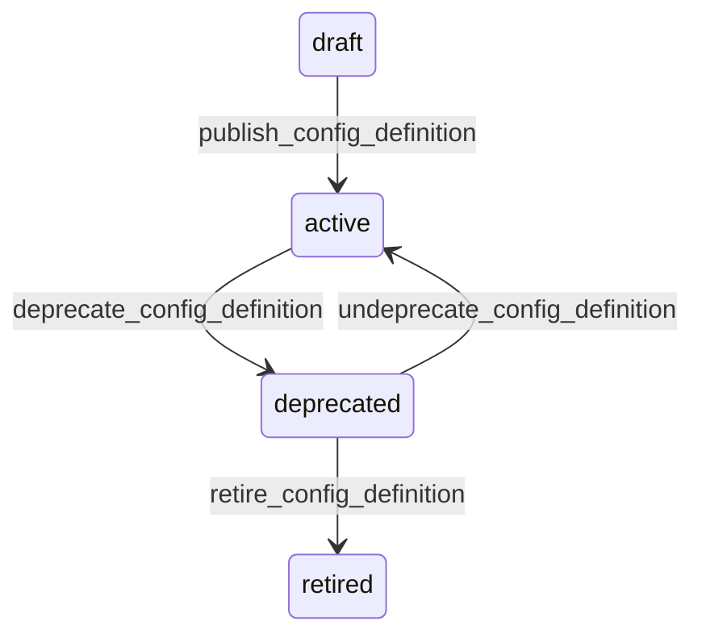

# State machine — Configuration Definition

*Generated. Edit `_model/capabilities/core_configuration.yaml`, not this file.*

## Transition matrix

| From \\ To | `draft` | `active` | `deprecated` | `retired` |
|---|---|---|---|---|
| **`draft`** | · | `publish_config_definition` | — | — |
| **`active`** | — | · | `deprecate_config_definition` | — |
| **`deprecated`** | — | `undeprecate_config_definition` | · | `retire_config_definition` |
| **`retired`** | — | — | — | · |

Any transition marked `—` attempted at runtime returns `E_PRECONDITION`. It is never a silent no-op, because a silent no-op is how an operator believes work was recorded when it was not.

## Stuck-state policy

### `draft`

A draft definition is invisible to tenants, so an abandoned draft costs nothing operationally and costs a great deal in the release notes, where a setting somebody promised does not exist. Threshold: draft_definition_stale_days (default 30). Told: the authoring platform_operator. Escape hatch: publish or delete. Deletion is permitted only in draft, which is the one state where no tenant can have depended on it.

### `active`

Steady state. Two monitored exceptions. (a) A setting that no tenant has ever changed from its default across the whole platform after never_overridden_days (default 365) - strong evidence that the setting should be a constant and that every tenant is paying for a decision nobody needed to make. This feeds AET-06, the count of decisions a tenant must answer, which is the metric that keeps onboarding from becoming consulting. (b) A setting overridden by more than half of tenants - strong evidence the shipped default is wrong. Both are reported to platform_operator quarterly, neither triggers an automatic change.

### `deprecated`

Deprecation is a migration that somebody has to finish. Threshold: deprecation_grace_days (default 180). Told: platform_operator, with the list of tenants still holding non-default values and what those values are. Escape hatch: migrate the remaining tenants, then retire. A definition that sits deprecated forever is worse than one that was never deprecated, because the surface now carries a warning nobody can act on.

### `retired`

Terminal. The definition no longer participates in resolution and no new value may reference it. Retained permanently together with the values once set against it, because 'what was this set to before the migration' is a question asked during incidents years later. Nothing pends.

