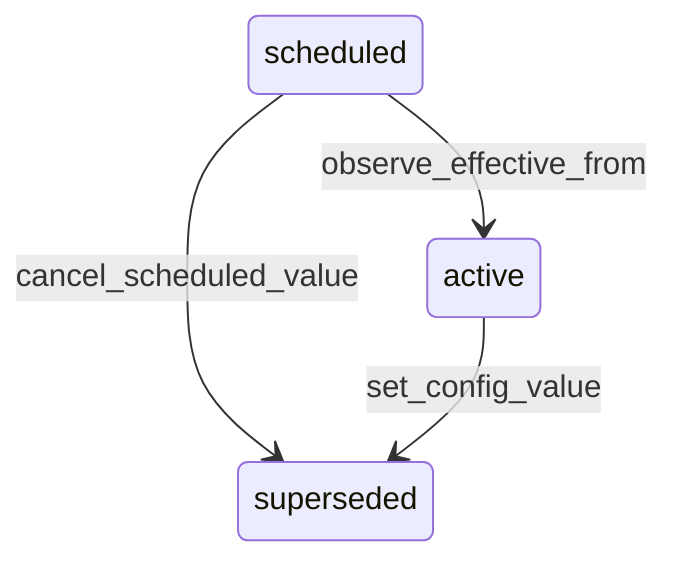

# State machine — Configuration Value

*Generated. Edit `_model/capabilities/core_configuration.yaml`, not this file.*

## Transition matrix

| From \\ To | `scheduled` | `active` | `superseded` |
|---|---|---|---|
| **`scheduled`** | · | `observe_effective_from` | `cancel_scheduled_value` |
| **`active`** | — | · | `set_config_value` |
| **`superseded`** | — | — | · |

Any transition marked `—` attempted at runtime returns `E_PRECONDITION`. It is never a silent no-op, because a silent no-op is how an operator believes work was recorded when it was not.

## Stuck-state policy

### `scheduled`

A scheduled change is a promise with a date on it, and the common failure is that the date passes without the scheduler running. Threshold: any scheduled value whose effective_from is more than scheduled_value_lag_minutes (default 15) in the past and which is still scheduled. Told: platform_operator, because this is scheduler machinery, and the setting principal, because they are the one whose change did not happen. Escape hatch: apply immediately. A second failure mode - a change scheduled so far ahead that its author has left - is bounded by refusing effective_from more than max_schedule_lead_days (default 365) ahead at write time.

### `active`

An active value is a steady state and is never stuck. The monitored exception is drift - the running system's observed behaviour disagreeing with the resolved value, detected by the manifest reconciliation sweep. Drift is an alert, not a surprise, per the composition model. Told: platform_operator and tenant_admin. Escape hatch: reconcile, which re-applies the resolved value and records what it found. A second exception - a value whose authored_against_capability_version is behind the installed version and whose definition changed - is a BROKEN override, blocks the upgrade in staging, and is listed with the tenant, the exact value and the change that broke it.

### `superseded`

Terminal. Retained for the audit retention period so that the history of a setting is answerable. Nothing pends.

