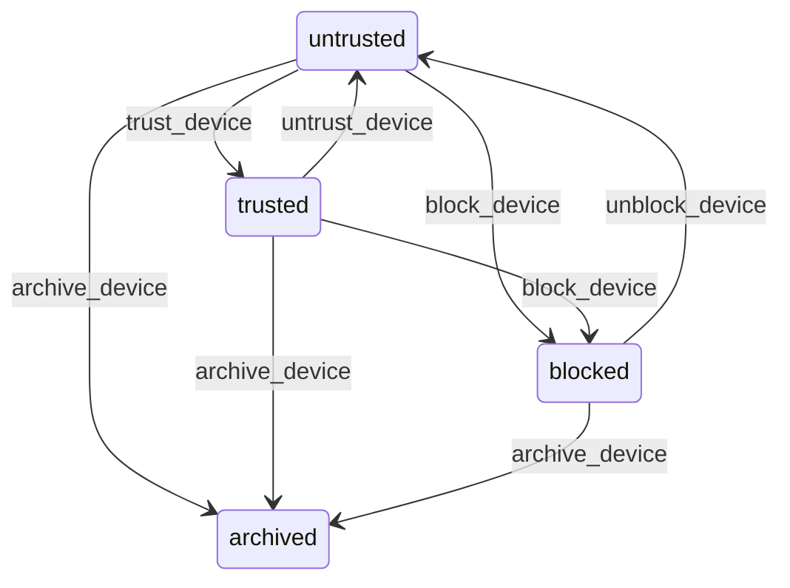

# State machine — Device

*Generated. Edit `_model/capabilities/core_identity_session.yaml`, not this file.*

## Transition matrix

| From \\ To | `untrusted` | `trusted` | `blocked` | `archived` |
|---|---|---|---|---|
| **`untrusted`** | · | `trust_device` | `block_device` | `archive_device` |
| **`trusted`** | `untrust_device` | · | `block_device` | `archive_device` |
| **`blocked`** | `unblock_device` | — | · | `archive_device` |
| **`archived`** | — | — | — | · |

Any transition marked `—` attempted at runtime returns `E_PRECONDITION`. It is never a silent no-op, because a silent no-op is how an operator believes work was recorded when it was not.

## Stuck-state policy

### `untrusted`

untrusted is a valid long-term steady state, not a queue — a personal phone belonging to a field worker may legitimately never be trusted. The monitored exception is a device that is untrusted AND stale: last_seen_at older than device_stale_days (default 60). Told: tenant_admin as a monthly list. Escape hatch: archive_device in bulk. Verity does not auto-archive, because an archived device that reappears with a full offline mutation queue is a worse problem than a stale row.

### `trusted`

The exception here is trust that has outlived its justification. Two triggers. (a) A trusted device unseen for device_trust_decay_days (default 90) is automatically transitioned to untrusted, not blocked, and the tenant_admin is told. Decay is automatic here — unlike principal dormancy — because trust is a security grant with no operational cost to re-issue, whereas an account is a person's access to their own work. (b) A trusted device below the minimum supported app version (min_supported_version_ok false) for longer than version_grace_days (default 30): told to the tenant_admin and to the device itself on next sign-in, because an unpatchable device that holds a long idle TTL is the weakest point in the session model. Escape hatch: update, untrust or archive.

### `blocked`

Blocking is meant to be a decision, not a limbo. A device blocked for longer than blocked_review_days (default 30) is reported to the tenant_admin with the blocking reason and actor. Escape hatch: unblock_device or archive_device. There is no automatic resolution: a device blocked because it was stolen must not quietly un-block itself on a timer.

