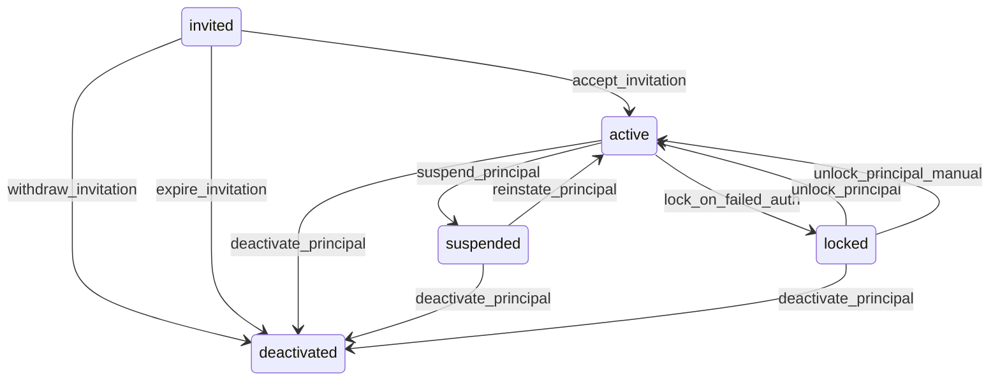

# State machine — Principal

*Generated. Edit `_model/capabilities/core_identity_session.yaml`, not this file.*

## Transition matrix

| From \\ To | `invited` | `active` | `suspended` | `locked` | `deactivated` |
|---|---|---|---|---|---|
| **`invited`** | · | `accept_invitation` | — | — | `expire_invitation` |
| **`active`** | — | · | `suspend_principal` | `lock_on_failed_auth` | `deactivate_principal` |
| **`suspended`** | — | `reinstate_principal` | · | — | `deactivate_principal` |
| **`locked`** | — | `unlock_principal_manual` | — | · | `deactivate_principal` |
| **`deactivated`** | — | — | — | — | · |

Any transition marked `—` attempted at runtime returns `E_PRECONDITION`. It is never a silent no-op, because a silent no-op is how an operator believes work was recorded when it was not.

## Stuck-state policy

### `invited`

An invitation that is never accepted is the single most common silent failure in onboarding, because nobody is watching for a thing that did not happen. Threshold: invitation_reminder_days (default 3) triggers one reminder on the invitation channel; invitation_ttl_days (default 14) transitions the principal to deactivated via expire_invitation. Told: the inviting principal, then the tenant_admin role on expiry, batched into one daily digest so a bulk import of 200 field staff does not produce 200 notifications. Escape hatch: re-invite, which mints a new token and a new principal row only if the original expired; otherwise it re-sends against the same row so the audit trail stays continuous. Deliberately NOT an escape hatch — an administrator marking a principal active without acceptance, because that would create an account nobody has ever authenticated as.

### `active`

active is the normal operating state and cannot be stuck in the usual sense, but two degenerate forms of it are operational exceptions and are monitored as such. (a) Never authenticated: principal.last_authenticated_at is null more than dormant_never_authenticated_days (default 30) after joining. Told: the tenant_admin, as a list, monthly. This is usually a person who was onboarded to a system they were never shown how to use, and it is the leading indicator of a failed rollout. (b) Dormant: last_authenticated_at older than dormant_principal_days (default 90). Told: tenant_admin. Escape hatch: bulk deactivate from the dormancy list, with the count typed to confirm. Verity does NOT auto-deactivate on dormancy; a worker on long medical leave losing their account automatically is worse than a stale row.

### `suspended`

Suspension is meant to be short — an investigation, a disputed absence, a contractual pause. A suspension is an operational exception after suspension_review_days (default 30). Told: the principal who suspended, escalating to tenant_owner after twice that. Escape hatch: reinstate_principal or deactivate_principal, both requiring a reason. The system never auto-resolves a suspension in either direction, because both directions have consequences the platform cannot judge.

### `locked`

Lockout is time-boxed by construction: locked_until is always set, and unlock_principal fires on expiry, so an instance cannot sit here indefinitely. The exception being monitored is repetition, not duration — a principal locked more than repeat_lockout_threshold times (default 3) in 24h is either under credential-stuffing attack or has a device with a cached wrong password, which look identical from the server and must be distinguished by asking. Told: the principal on their alternate channel, and the tenant_admin. Escape hatch: unlock_principal_manual, or phone-OTP sign-in, which is a separate credential and is deliberately not blocked by a password lockout.

### `deactivated`

Terminal for authentication. No instance can be stuck here because nothing is pending. The row is retained while any audit row, event or operational record references it; deletion is a retention-job or DSR-erasure concern, not a lifecycle transition. Reactivation is deliberately absent from the transition set — see open_questions on rehire identity continuity, which is an unresolved product choice and is not being invented here.

