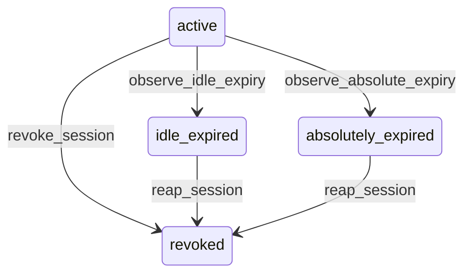

# State machine — Session

*Generated. Edit `_model/capabilities/core_identity_session.yaml`, not this file.*

## Transition matrix

| From \\ To | `active` | `idle_expired` | `absolutely_expired` | `revoked` |
|---|---|---|---|---|
| **`active`** | · | `observe_idle_expiry` | `observe_absolute_expiry` | `revoke_session` |
| **`idle_expired`** | — | · | — | `reap_session` |
| **`absolutely_expired`** | — | — | · | `reap_session` |
| **`revoked`** | — | — | — | · |

Any transition marked `—` attempted at runtime returns `E_PRECONDITION`. It is never a silent no-op, because a silent no-op is how an operator believes work was recorded when it was not.

## Stuck-state policy

### `active`

Bounded by construction: absolute_expiry_at is immutable and mandatory, so no session can remain active indefinitely. The monitored exception is a session that is active far longer than its surface's norm — a console session at the 720h policy ceiling is almost always a misconfiguration copied from a shared-terminal policy. Threshold: any session whose absolute TTL exceeds session_ttl_alert_hours for its surface (default: 24 for console, 168 for shared surfaces). Told: tenant_admin, once per policy change rather than once per session. Escape hatch: change the policy knob; existing sessions are NOT retroactively shortened, because shortening a live shift-long session mid-shift is an outage.

### `idle_expired`

A session should not linger here — it is a row that is dead but not yet marked dead, and any bug in expiry evaluation turns it back into a live credential. Threshold: the reaper sweeps every reaper_interval_minutes (default 15); a row older than 4 sweep intervals is a platform alert, not a tenant alert, because it means the reaper is not running. Told: platform_operator via the platform health channel. Escape hatch: manual reaper run. Note that authorisation does not depend on the reaper — every request re-evaluates expiry server-side, so a stuck reaper degrades observability and audit tidiness, not security.

### `absolutely_expired`

Identical policy to idle_expired, same reaper, same platform alert. Separated as a distinct state only so that the revocation_reason written at reap time is accurate without re-deriving it from timestamps at reap time, which would be wrong for any session that idled out and then also passed its absolute expiry before being swept.

### `revoked`

Terminal and immutable. Retained for the security audit retention period (7 years per the security audit class), then purged by the retention job. Nothing pends.

