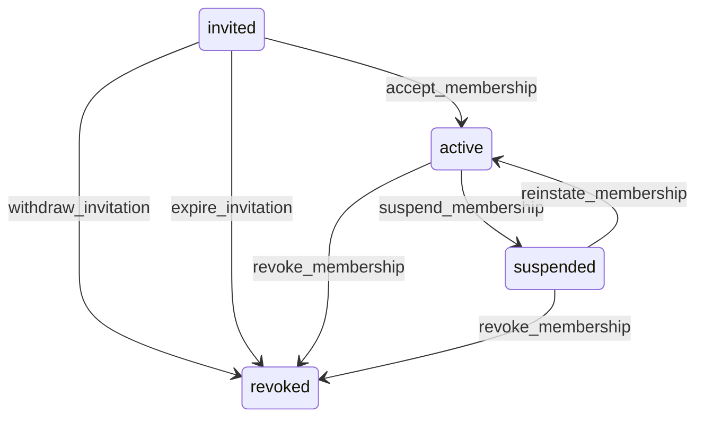

# State machine — Tenant Membership

*Generated. Edit `_model/capabilities/core_identity_session.yaml`, not this file.*

## Transition matrix

| From \\ To | `invited` | `active` | `suspended` | `revoked` |
|---|---|---|---|---|
| **`invited`** | · | `accept_membership` | — | `expire_invitation` |
| **`active`** | — | · | `suspend_membership` | `revoke_membership` |
| **`suspended`** | — | `reinstate_membership` | · | `revoke_membership` |
| **`revoked`** | — | — | — | · |

Any transition marked `—` attempted at runtime returns `E_PRECONDITION`. It is never a silent no-op, because a silent no-op is how an operator believes work was recorded when it was not.

## Stuck-state policy

### `invited`

Same clock as principal.invited, but tracked separately because a principal may be active in tenant A and still pending in tenant B, and the tenant B administrator can see nothing about tenant A. Threshold: invitation_ttl_days (default 14), reminder at invitation_reminder_days (default 3). Told: the inviting principal, batched daily. Escape hatch: re-invite or withdraw. A membership invitation is never auto-accepted on the strength of the principal already being active elsewhere; consenting to join one workspace is not consent to join another.

### `active`

A membership whose principal has never landed on its default_landing_surface after membership_unused_days (default 30) is reported to the tenant_admin. This most often means the role granted has no navigation entries the person can actually reach, which is a composition defect in the tenant manifest rather than a user problem, and the report links to the resolved navigation tree for that role so it can be diagnosed rather than guessed at. No automatic action.

### `suspended`

Reviewed at suspension_review_days (default 30), escalating to tenant_owner at 60. Escape hatch: reinstate_membership or revoke_membership. A suspended membership continues to count against any seat-based plan limit until revoked, and the review notification says so explicitly, because a silently billed suspended seat is the kind of thing that destroys trust in an invoice.

### `revoked`

Terminal. Nothing pends. The row is retained permanently as the attribution target for that person's operational history. Re-granting access creates a NEW membership row rather than resurrecting this one, so that the access history reads as two distinct periods with a gap, which is what an auditor needs to see.

