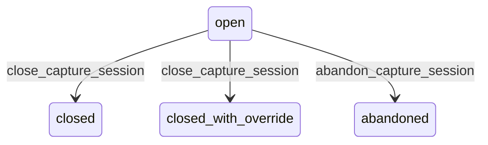

# State machine — Capture Session

*Generated. Edit `_model/capabilities/evidence_capture.yaml`, not this file.*

## Transition matrix

| From \\ To | `open` | `closed` | `closed_with_override` | `abandoned` |
|---|---|---|---|---|
| **`open`** | · | `close_capture_session` | `close_capture_session` | `abandon_capture_session` |
| **`closed`** | — | · | — | — |
| **`closed_with_override`** | — | — | · | — |
| **`abandoned`** | — | — | — | · |

Any transition marked `—` attempted at runtime returns `E_PRECONDITION`. It is never a silent no-op, because a silent no-op is how an operator believes work was recorded when it was not.

## Stuck-state policy

### `open`

An open session is a capture in progress on a device. Threshold: session_lifetime_hours (default 24), after which it is abandoned automatically and its items are retained as orphaned. Told: the capturing principal at half the lifetime. Escape hatch: close, close with an override, or abandon. The reason the lifetime exists is that an open session holds items in pending_upload with no owning mutation to replay them with, and those items are the ones most likely to be lost.

### `closed`

Terminal. Bounded by the upload state of its items. The monitored exception is a closed session whose owning mutation replayed successfully while one of its items is still pending upload - the act is recorded and its evidence is not yet present. Told: the supervisor, because a completion showing as evidenced when the photograph has not arrived is exactly the gap a dispute finds.

### `closed_with_override`

Terminal. Every downstream artefact carries the override marker. The monitored condition is the rate, which is the requirement''s own active policy. Nothing individually pends.

### `abandoned`

Terminal. Its items are retained as orphaned with their own retention, and the orphaned set is reported monthly to ops_manager, because orphaned evidence is either somebody's wasted effort or evidence of an act that was never recorded, and the second is worth looking at.

