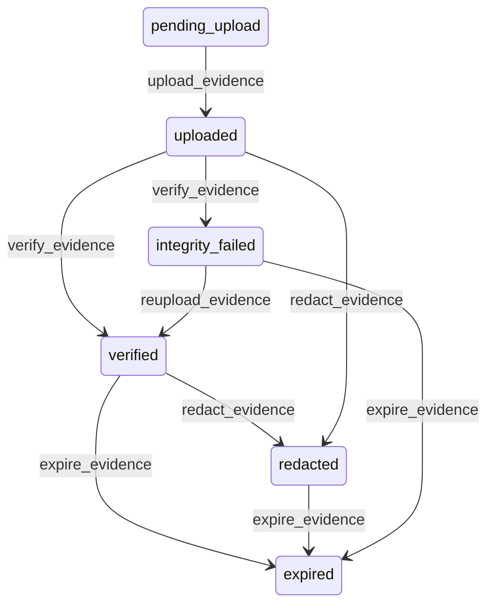

# State machine — Evidence Item

*Generated. Edit `_model/capabilities/evidence_capture.yaml`, not this file.*

## Transition matrix

| From \\ To | `pending_upload` | `uploaded` | `verified` | `integrity_failed` | `redacted` | `expired` |
|---|---|---|---|---|---|---|
| **`pending_upload`** | · | `upload_evidence` | — | — | — | — |
| **`uploaded`** | — | · | `verify_evidence` | `verify_evidence` | `redact_evidence` | — |
| **`verified`** | — | — | · | — | `redact_evidence` | `expire_evidence` |
| **`integrity_failed`** | — | — | `reupload_evidence` | · | — | `expire_evidence` |
| **`redacted`** | — | — | — | — | · | `expire_evidence` |
| **`expired`** | — | — | — | — | — | · |

Any transition marked `—` attempted at runtime returns `E_PRECONDITION`. It is never a silent no-op, because a silent no-op is how an operator believes work was recorded when it was not.

## Stuck-state policy

### `pending_upload`

Evidence that exists on a device and nowhere else. It is the most fragile state in the platform - a lost or wiped handset destroys it permanently - and it is entirely normal for hours at a time. Threshold: pending_upload_alert_hours (default 12), and pending_upload_critical_hours (default 72) at which the owning record is marked as having evidence that may never arrive. Told: the capturing principal first, because the fix is usually to find a signal; then the supervisor. Escape hatch: upload, or explicitly abandon with a reason recorded on the owning record. Verity never quietly forgets a pending item - the reference exists server-side from the moment of capture precisely so that missing evidence is visible rather than invisible.

### `uploaded`

Uploaded and unverified is a short mechanical window. Threshold: verification_lag_minutes (default 15). Told: platform_operator, because this is machinery. The owning record shows the evidence as unverified rather than as verified, so nothing downstream treats it as stronger than it is while the check is outstanding.

### `verified`

Steady state for the retention period. The monitored exception is a periodic re-verification sweep finding a mismatch on stored content, which means the storage has been altered or corrupted since receipt. Told: platform_operator and tenant_owner simultaneously, at the highest severity, not suppressible. Escape hatch: none - it is either a storage fault or an intrusion and both need a human.

### `integrity_failed`

Threshold: immediate. Told: the capturing principal, the supervisor and platform_operator. Escape hatch: re-upload from the device where the original still exists, or accept the item as unverified with a recorded decision. The item is NOT discarded, because a failed transfer is far more common than a substitution and discarding it destroys the only copy. Every downstream consumer sees it as unverified and the difference is carried into any dispute.

### `redacted`

Terminal in content terms. Retained with the original hash so the redaction is provable. The monitored condition is a redaction rate above redaction_rate_alert, told to tenant_owner, because habitual redaction is either a capture process collecting things it should not or an attempt to edit history.

### `expired`

Terminal. The tombstone retains the hash, the metadata and the expiry job reference permanently, so that a question about what once existed is answerable. Nothing pends.

