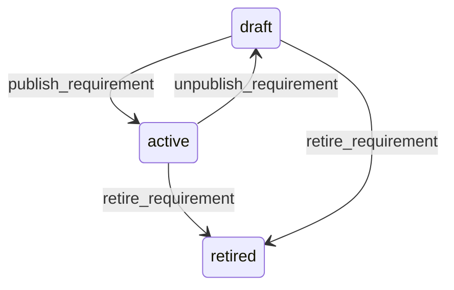

# State machine — Evidence Requirement

*Generated. Edit `_model/capabilities/evidence_capture.yaml`, not this file.*

## Transition matrix

| From \\ To | `draft` | `active` | `retired` |
|---|---|---|---|
| **`draft`** | · | `publish_requirement` | `retire_requirement` |
| **`active`** | `unpublish_requirement` | · | `retire_requirement` |
| **`retired`** | — | — | · |

Any transition marked `—` attempted at runtime returns `E_PRECONDITION`. It is never a silent no-op, because a silent no-op is how an operator believes work was recorded when it was not.

## Stuck-state policy

### `draft`

Threshold: draft_requirement_stale_days (default 21). Told: the creating principal. Escape hatch: publish or retire. The characteristic confusion is somebody having specified that a photograph is now required and finding that nothing is asking for it.

### `active`

Two monitored exceptions. (a) A requirement satisfied by override more than override_rate_alert of the time (default 0.2) - it is being routinely bypassed, which means either the requirement is impractical or the override is too easy, and both are worth knowing. Told: ops_manager and the declaring capability's owner, monthly. (b) A requirement whose captured items are overwhelmingly satisfied-without-provenance while requires_live_capture is true, meaning the control is nominal on the devices actually in use. Told: ops_manager, because the tenant may believe they have a control they do not have.

### `retired`

Terminal. Retained permanently, because existing evidence resolves its retention and its meaning against it. Nothing pends.

