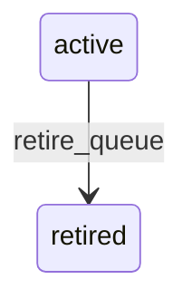

# State machine — Queue

*Generated. Edit `_model/capabilities/helpdesk.yaml`, not this file.*

## Transition matrix

| From \\ To | `active` | `retired` |
|---|---|---|
| **`active`** | · | `retire_queue` |
| **`retired`** | — | · |

Any transition marked `—` attempted at runtime returns `E_PRECONDITION`. It is never a silent no-op, because a silent no-op is how an operator believes work was recorded when it was not.

## Stuck-state policy

### `active`

The monitored conditions are about the queue rather than its tickets. (a) A queue whose watcher roles currently have no active holder - nobody is watching, which is invisible from inside any individual ticket. Told: ops_manager, immediately on the condition arising rather than on a timer, because it arises the moment somebody leaves. (b) A queue whose oldest untriaged ticket exceeds the triage target by queue_backlog_multiple (default 3). Told: the watchers and the supervisor. (c) A default queue receiving more than default_queue_share of all tickets (default 0.3), which means routing rules are not matching and everything is falling through to the catch-all - a configuration problem that presents as a workload problem.

### `retired`

Terminal. Retained so historical tickets resolve to where they were handled. Nothing pends.

