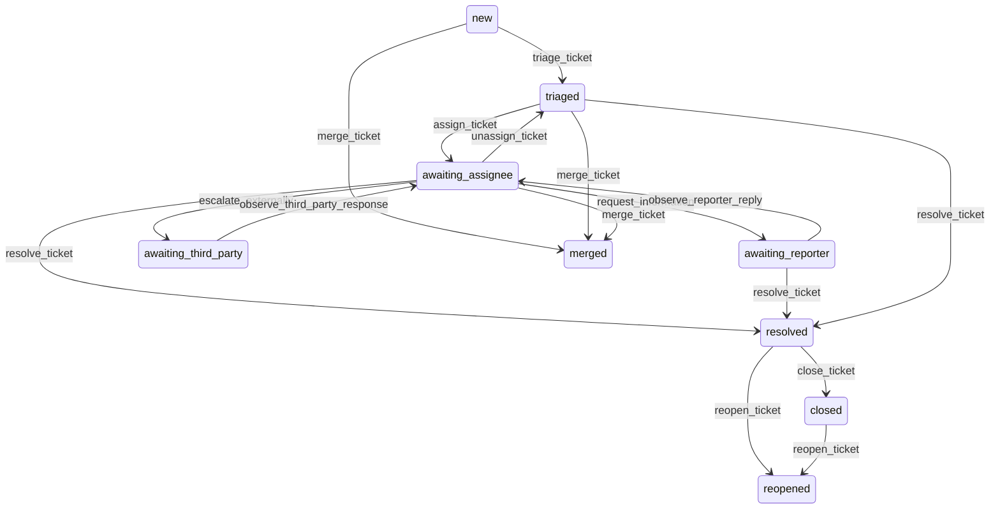

# State machine — Ticket

*Generated. Edit `_model/capabilities/helpdesk.yaml`, not this file.*

## Transition matrix

| From \\ To | `new` | `triaged` | `awaiting_assignee` | `awaiting_reporter` | `awaiting_third_party` | `resolved` | `closed` | `merged` | `reopened` |
|---|---|---|---|---|---|---|---|---|---|
| **`new`** | · | `triage_ticket` | — | — | — | — | — | `merge_ticket` | — |
| **`triaged`** | — | · | `assign_ticket` | — | — | `resolve_ticket` | — | `merge_ticket` | — |
| **`awaiting_assignee`** | — | `unassign_ticket` | · | `request_information` | `escalate_externally` | `resolve_ticket` | — | `merge_ticket` | — |
| **`awaiting_reporter`** | — | — | `observe_reporter_reply` | · | — | `resolve_ticket` | — | — | — |
| **`awaiting_third_party`** | — | — | `observe_third_party_response` | — | · | — | — | — | — |
| **`resolved`** | — | — | — | — | — | · | `close_ticket` | — | `reopen_ticket` |
| **`closed`** | — | — | — | — | — | — | · | — | `reopen_ticket` |
| **`merged`** | — | — | — | — | — | — | — | · | — |
| **`reopened`** | — | — | — | — | — | — | — | — | · |

Any transition marked `—` attempted at runtime returns `E_PRECONDITION`. It is never a silent no-op, because a silent no-op is how an operator believes work was recorded when it was not.

## Stuck-state policy

### `new`

An untriaged ticket is a report nobody has looked at, and the first-response clock is running against it. Threshold: triage_target_minutes (default 30 in working hours, priority-adjusted). Told: every principal watching the default queue, then the supervisor. Escape hatch: triage, or merge as a duplicate. Verity never auto-triages into a queue on a low-confidence rule match; where the rule is uncertain it lands in the default queue with the uncertainty stated, because a confidently wrong routing is worse than an unrouted ticket somebody can see.

### `triaged`

Triaged and unassigned. Threshold: assignment_target_minutes (default 60, priority-adjusted). Told: the queue watchers, then the supervisor. Escape hatch: assign, or resolve directly. The specific monitored case is a queue with no active watcher at all, which is reported against the queue rather than against each ticket - otherwise one unwatched queue produces a hundred identical alerts.

### `awaiting_assignee`

The working state. Threshold: no update of any kind for stale_ticket_hours (default 24, shorter at higher priority), or the approaching breach position from the sla_clock where one is bound, whichever comes first. Told: the assignee, then the supervisor. Escape hatch: update, resolve, or hand back. An assignee absent or on leave is the common cause, which is why the notification carries their availability where the resource port resolves it.

### `awaiting_reporter`

The largest source of tickets that never end, and the one most often mishandled. Threshold: reporter_chase_days (default 3), with at most max_reporter_chases (default 2) reminders, then resolution as no_response_from_reporter after awaiting_reporter_days (default 10). Told: the reporter, then the assignee. This is the ONE place the model permits an automatic resolution, and it is permitted only because the alternative - an unbounded queue of tickets waiting on people who have moved on - makes every other metric meaningless. It resolves as no_response_from_reporter, never as resolved, so the distinction survives into every report, and the reporter is told that it has been closed and how to reopen.

### `awaiting_third_party`

Threshold: third_party_chase_days (default 3), escalating to the supervisor and then to whoever owns the supplier relationship. Told: the assignee and the relationship owner. Escape hatch: chase, resolve without them, or escalate commercially. The elapsed third-party time is reported separately and cumulatively per third party, because that total is the only number that changes a supplier's behaviour.

### `resolved`

Resolved and unclosed is a reporter who has not confirmed. Threshold: confirmation_window_days (default 5), after which it closes automatically. Told: the reporter once, at resolution, with how to reopen. Automatic closure here is safe because reopening remains available for the full reopen window, so nothing is lost.

### `closed`

Terminal unless reopened. The one thing still pending is satisfaction where the tenant collects it. A closed ticket whose converted work is still open is reported to the supervisor, because a reporter told their matter is closed while the work is outstanding will telephone, and they will be right to.

### `merged`

Terminal. Retained permanently with its correspondence and its link to the target, because a reporter who quotes the merged reference must still be findable by it, and because merging is the easiest way to make a response-time figure look better than it is - which is why merged tickets contribute no measurement and the merge rate is monitored.

### `reopened`

Terminal on this ticket; the successor carries the matter. The monitored condition is a chain longer than reopen_chain_alert (default 1), told immediately to the supervisor and to the category owner, because a second reopen means the resolution approach is wrong and a third attempt at the same approach will not fix it.

