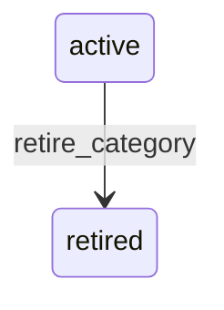

# State machine — Category

*Generated. Edit `_model/capabilities/helpdesk.yaml`, not this file.*

## Transition matrix

| From \\ To | `active` | `retired` |
|---|---|---|
| **`active`** | · | `retire_category` |
| **`retired`** | — | · |

Any transition marked `—` attempted at runtime returns `E_PRECONDITION`. It is never a silent no-op, because a silent no-op is how an operator believes work was recorded when it was not.

## Stuck-state policy

### `active`

Monitored exceptions. (a) A category whose reopen rate exceeds category_reopen_alert (default 0.15) over a quarter - the resolutions in this category are not sticking, which is the most actionable quality signal a helpdesk produces. Told: the category owner and ops_manager. (b) A category whose own targets differ from the applicable contract targets, which means somebody is measured against one number and promised another. Told: the category owner and the contract owner. (c) A category used on fewer than category_floor of tickets (default 0.005) over a year, which is clutter in a picker that a reporter has to read.

### `retired`

Terminal. Retained. Nothing pends.

