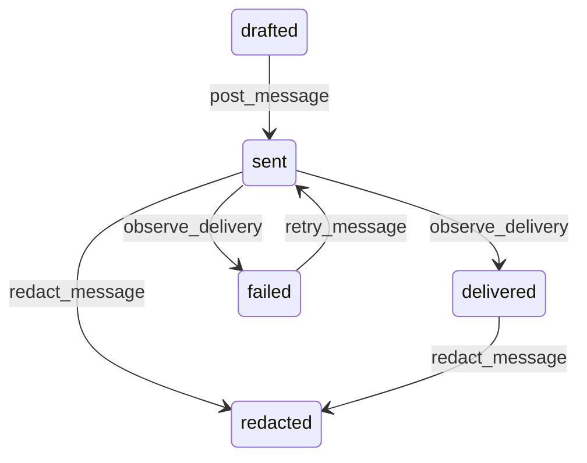

# State machine — Ticket Message

*Generated. Edit `_model/capabilities/helpdesk.yaml`, not this file.*

## Transition matrix

| From \\ To | `drafted` | `sent` | `delivered` | `failed` | `redacted` |
|---|---|---|---|---|---|
| **`drafted`** | · | `post_message` | — | — | — |
| **`sent`** | — | · | `observe_delivery` | `observe_delivery` | `redact_message` |
| **`delivered`** | — | — | · | — | `redact_message` |
| **`failed`** | — | `retry_message` | — | · | — |
| **`redacted`** | — | — | — | — | · |

Any transition marked `—` attempted at runtime returns `E_PRECONDITION`. It is never a silent no-op, because a silent no-op is how an operator believes work was recorded when it was not.

## Stuck-state policy

### `drafted`

A drafted reply is an answer somebody wrote and did not send. Threshold: draft_message_stale_hours (default 4). Told: the author only. Escape hatch: send or discard. This is a small thing that matters, because the reporter is waiting and the assignee believes they have replied.

### `sent`

Bounded by delivery confirmation where the channel supports it. Threshold: delivery_confirm_hours (default 2). Told: the assignee, because an unconfirmed reply is indistinguishable to them from a reporter who has not answered.

### `delivered`

Terminal. Retained permanently. Nothing pends.

### `failed`

Threshold: immediate. Told: the assignee with the failure reason, because the correct action is to try another channel or telephone, and the assignee is the only person who can decide which. Escape hatch: retry on another channel. A failed message never silently retries on the same address, because the address is usually the problem.

### `redacted`

Terminal. Retained permanently as a redacted message. The monitored condition is a redaction rate above redaction_rate_alert, told to ops_manager, because habitual redaction is either a data-handling problem upstream or an attempt to edit history.

