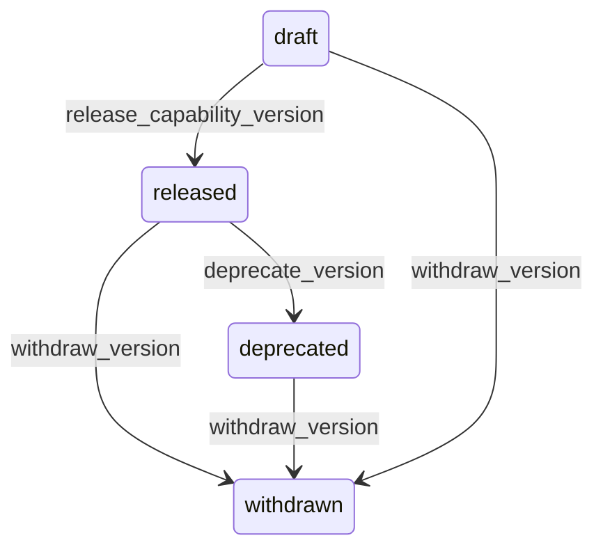

# State machine — Capability Version

*Generated. Edit `_model/capabilities/hq_console.yaml`, not this file.*

## Transition matrix

| From \\ To | `draft` | `released` | `deprecated` | `withdrawn` |
|---|---|---|---|---|
| **`draft`** | · | `release_capability_version` | — | `withdraw_version` |
| **`released`** | — | · | `deprecate_version` | `withdraw_version` |
| **`deprecated`** | — | — | · | `withdraw_version` |
| **`withdrawn`** | — | — | — | · |

Any transition marked `—` attempted at runtime returns `E_PRECONDITION`. It is never a silent no-op, because a silent no-op is how an operator believes work was recorded when it was not.

## Stuck-state policy

### `draft`

Threshold: draft_version_stale_days (default 30). Told: the authoring platform_operator. Escape hatch: release or withdraw. Low urgency; the risk is a version everybody believes is available.

### `released`

Steady state. Two monitored conditions. (a) A released version on which fewer than adoption_floor of eligible tenants sit after adoption_window_days (default 90), which means upgrades are not happening and the platform is accumulating a long tail it will eventually have to support. (b) A released version whose override_impact_summary shows breakage for tenants who have not been contacted. Told: platform_operator, and this is the condition under which an upgrade becomes a surprise for a customer.

### `deprecated`

A deprecated version with tenants still on it is support debt with a date on it. Threshold: deprecation_grace_days (default 180), then monthly. Told: platform_operator with the tenant list, and each affected tenant_owner. Escape hatch: migrate the remaining tenants, or extend the grace deliberately. A version deprecated forever is worse than one never deprecated, because the warning becomes noise.

### `withdrawn`

A withdrawn version with tenants still running it is an active incident, not a queue. Threshold: immediate, then every withdrawal_chase_hours (default 4) until every tenant has moved. Told: platform_operator, tenant_owner of every affected tenant, and the relationship owners. Escape hatch: move them. There is no timer that resolves this and no threshold at which it stops escalating.

