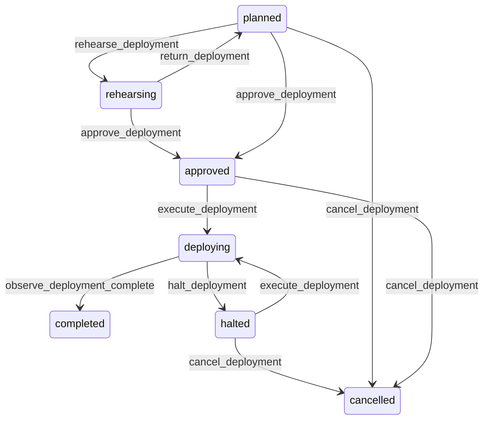

# State machine — Deployment

*Generated. Edit `_model/capabilities/hq_console.yaml`, not this file.*

## Transition matrix

| From \\ To | `planned` | `rehearsing` | `approved` | `deploying` | `completed` | `halted` | `cancelled` |
|---|---|---|---|---|---|---|---|
| **`planned`** | · | `rehearse_deployment` | `approve_deployment` | — | — | — | `cancel_deployment` |
| **`rehearsing`** | `return_deployment` | · | `approve_deployment` | — | — | — | — |
| **`approved`** | — | — | · | `execute_deployment` | — | — | `cancel_deployment` |
| **`deploying`** | — | — | — | · | `observe_deployment_complete` | `halt_deployment` | — |
| **`completed`** | — | — | — | — | · | — | — |
| **`halted`** | — | — | — | `execute_deployment` | — | · | `cancel_deployment` |
| **`cancelled`** | — | — | — | — | — | — | · |

Any transition marked `—` attempted at runtime returns `E_PRECONDITION`. It is never a silent no-op, because a silent no-op is how an operator believes work was recorded when it was not.

## Stuck-state policy

### `planned`

Threshold: planned_deployment_stale_days (default 14). Told: the planning operator. Escape hatch: rehearse or cancel. The specific risk is a plan built against a library state that has since moved, so a plan older than the threshold is re-validated before it can be approved.

### `rehearsing`

Threshold: rehearsal_timeout_hours (default 4). Told: platform_operator. Escape hatch: investigate or cancel. A rehearsal that hangs is usually a staging environment problem rather than a deployment problem, and the two look identical until somebody looks.

### `approved`

Approved and unexecuted is the most dangerous of these states, because everybody involved believes the change is live. Threshold: approved_unexecuted_hours (default 48), and approval expires at approval_validity_days (default 7), after which it returns to rehearsing. Told: the approver and the planner. An approval given against a week-old rehearsal is an approval of something else.

### `deploying`

Bounded by the wave schedule. The monitored exception is a wave that neither succeeds nor fails within wave_timeout_minutes (default 30), which usually means a tenant-level migration that is taking far longer than rehearsal suggested. Told: platform_operator immediately, with the tenant. Escape hatch: halt. A deployment that is neither progressing nor halted is the state in which a fleet-wide change does the most damage.

### `completed`

Terminal. The follow-on obligation is post-deploy reconciliation for every target, which is tracked on the manifest rather than here so that a failed reconciliation does not make a completed deployment look incomplete. Nothing else pends.

### `halted`

A halted deployment leaves the fleet on mixed versions, which is precisely the condition DEC-C-003 has not resolved. Threshold: immediate, then hourly. Told: platform_operator and the relationship owners of every affected tenant. Escape hatch: resume, or cancel and accept the skew deliberately. Nothing resolves this on a timer, because both resolutions are decisions with cost.

### `cancelled`

Terminal. Retained with the reason and with the list of tenants left on the new version, because a cancelled deployment that partly happened is the origin of a version skew somebody will later be puzzled by. Nothing pends.

