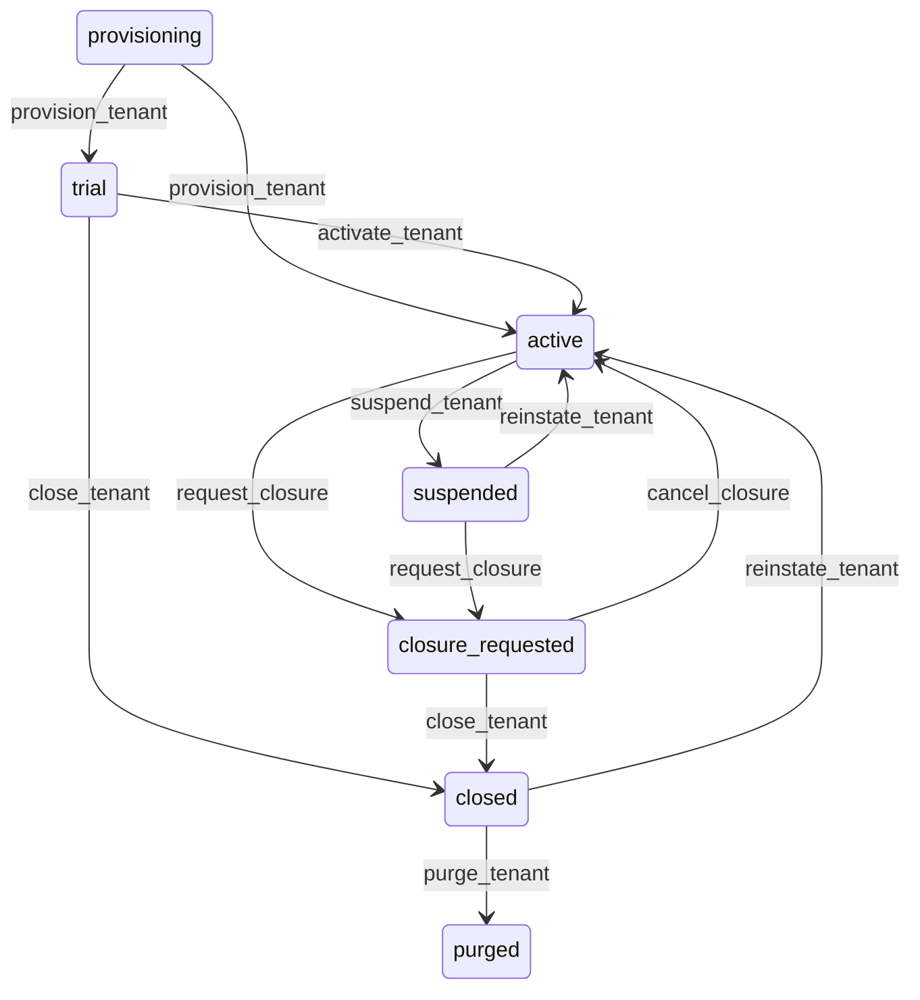

# State machine — Tenant

*Generated. Edit `_model/capabilities/hq_console.yaml`, not this file.*

## Transition matrix

| From \\ To | `provisioning` | `trial` | `active` | `suspended` | `closure_requested` | `closed` | `purged` |
|---|---|---|---|---|---|---|---|
| **`provisioning`** | · | `provision_tenant` | `provision_tenant` | — | — | — | — |
| **`trial`** | — | · | `activate_tenant` | — | — | `close_tenant` | — |
| **`active`** | — | — | · | `suspend_tenant` | `request_closure` | — | — |
| **`suspended`** | — | — | `reinstate_tenant` | · | `request_closure` | — | — |
| **`closure_requested`** | — | — | `cancel_closure` | — | · | `close_tenant` | — |
| **`closed`** | — | — | `reinstate_tenant` | — | — | · | `purge_tenant` |
| **`purged`** | — | — | — | — | — | — | · |

Any transition marked `—` attempted at runtime returns `E_PRECONDITION`. It is never a silent no-op, because a silent no-op is how an operator believes work was recorded when it was not.

## Stuck-state policy

### `provisioning`

A tenant stuck in provisioning is a customer who has bought something they cannot use. Threshold: provisioning_alert_minutes (default 30). Told: platform_operator and whoever owns the commercial relationship. Escape hatch: complete or roll back. The characteristic failure is a manifest that applies partially and leaves a workspace reachable with half its capabilities, which is worse than one that is not reachable at all - so a failed provisioning rolls back rather than leaving a partial tenant.

### `trial`

Bounded by the trial period. The monitored exception is a trial with no sign-in for trial_silence_days (default 7), which is a customer who has not started rather than one who has decided. Told: whoever owns the relationship. Escape hatch: contact them. This is a commercial monitor living in a technical capability because it is the only place that knows.

### `active`

Steady state. Four monitored conditions. (a) Manifest drift - the running system disagreeing with the current manifest. Told: platform_operator, always, and never auto-corrected. (b) A tenant whose seat usage exceeds its entitlement, told to the relationship owner rather than enforced, because cutting off access over a commercial matter is a decision for a person. (c) A tenant on a capability version more than version_lag_alert minor versions behind, which is where upgrade debt accumulates silently until an upgrade becomes a project. (d) A tenant with no tenant_owner able to sign in - the last-owner protection should make this impossible and its occurrence is a defect alert rather than an operational one.

### `suspended`

A suspended tenant is a commercial dispute with a clock on it. Threshold: suspension_review_days (default 14), then weekly to the relationship owner and platform_operator. Told: the tenant_owner throughout, with what is required to reinstate. Escape hatch: reinstate or move to closure. Verity never escalates a suspension into a closure automatically, because the two have completely different consequences and only the second is irreversible.

### `closure_requested`

Bounded by the erasure date, which is the most consequential date in the platform. Threshold: notification to the tenant_owner at the closure request, at export delivery, at half the retention window, at 7 days and at 1 day before erasure. Told: the tenant_owner and the relationship owner. Escape hatch: cancel, or proceed. The export must be delivered before erasure and the model refuses the purge without it, because destroying a customer's records before returning them is unrecoverable.

### `closed`

Bounded by the erasure date. Reinstatement remains available throughout, which is deliberate - a business that closes and returns is common and forcing a fresh workspace loses their history. Told: nobody routinely; the erasure countdown is the notification.

### `purged`

Terminal. The tenant row, the manifest history, the purge audit and the fact that the tenant existed are retained permanently. A purge that removed the record of the purge would make the platform unable to answer whether a customer ever existed, which is a question asked by both regulators and former customers. Nothing pends.

