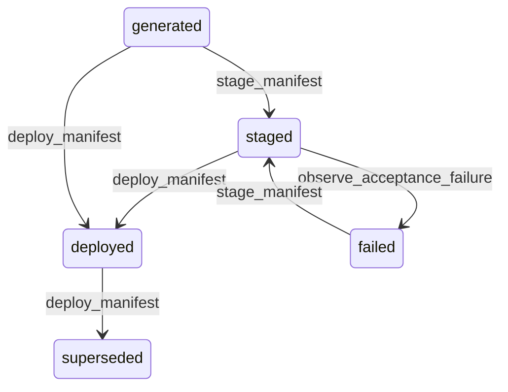

# State machine — Tenant Manifest

*Generated. Edit `_model/capabilities/hq_console.yaml`, not this file.*

## Transition matrix

| From \\ To | `generated` | `staged` | `deployed` | `superseded` | `failed` |
|---|---|---|---|---|---|
| **`generated`** | · | `stage_manifest` | `deploy_manifest` | — | — |
| **`staged`** | — | · | `deploy_manifest` | — | `observe_acceptance_failure` |
| **`deployed`** | — | — | · | `deploy_manifest` | — |
| **`superseded`** | — | — | — | · | — |
| **`failed`** | — | `stage_manifest` | — | — | · |

Any transition marked `—` attempted at runtime returns `E_PRECONDITION`. It is never a silent no-op, because a silent no-op is how an operator believes work was recorded when it was not.

## Stuck-state policy

### `generated`

Threshold: generated_manifest_stale_days (default 7). Told: the generating operator. Escape hatch: stage, deploy or discard. A generated and undeployed manifest is a change somebody intended and did not make, and the tenant is still running the previous one.

### `staged`

A staged manifest occupies the tenant's staging environment and blocks the next change. Threshold: staged_manifest_stale_days (default 3). Told: the operator, then platform_operator generally. Escape hatch: deploy, revert or evict. The eviction is never silent, for the same reason it is never silent in core_configuration.

### `deployed`

The steady state, and the one the drift monitor watches. Threshold: reconciliation runs every reconciliation_interval_hours (default 6), and a manifest not reconciled for four intervals is a platform alert. Told: platform_operator for reconciliation failure, and platform_operator plus tenant_admin for drift findings. Escape hatch: regenerate the manifest to match reality, or correct reality to match the manifest - and the choice between those two is exactly why drift is reported rather than auto-corrected.

### `superseded`

Terminal. Retained permanently, because the question of what a tenant was running on a given date is asked during every incident review and every dispute. This is the entity that makes that question answerable at all. Nothing pends.

### `failed`

Threshold: immediate. Told: the operator with the specific acceptance failures. Escape hatch: correct and re-stage, or abandon. A failed manifest is the system working as intended and the notification says so, because otherwise the staging gate is experienced as an obstacle rather than as a control.

