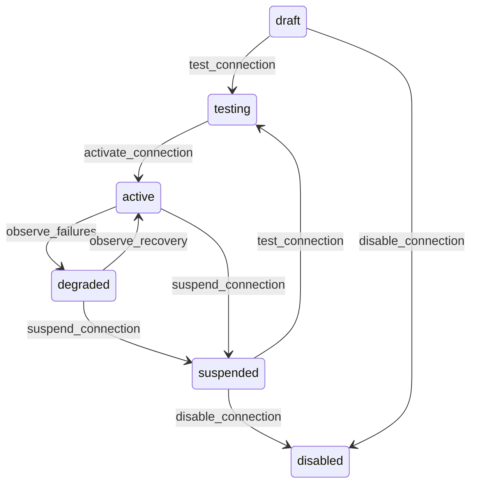

# State machine — Connection

*Generated. Edit `_model/capabilities/integrations.yaml`, not this file.*

## Transition matrix

| From \\ To | `draft` | `testing` | `active` | `degraded` | `suspended` | `disabled` |
|---|---|---|---|---|---|---|
| **`draft`** | · | `test_connection` | — | — | — | `disable_connection` |
| **`testing`** | — | · | `activate_connection` | — | — | — |
| **`active`** | — | — | · | `observe_failures` | `suspend_connection` | — |
| **`degraded`** | — | — | `observe_recovery` | · | `suspend_connection` | — |
| **`suspended`** | — | `test_connection` | — | — | · | `disable_connection` |
| **`disabled`** | — | — | — | — | — | · |

Any transition marked `—` attempted at runtime returns `E_PRECONDITION`. It is never a silent no-op, because a silent no-op is how an operator believes work was recorded when it was not.

## Stuck-state policy

### `draft`

Threshold: draft_connection_stale_days (default 7). Told: the creating principal. Escape hatch: test and activate, or disable. The characteristic failure is a connection configured during onboarding whose credential was never supplied, so an entire integration silently does nothing while the tenant believes it is live.

### `testing`

Threshold: testing_stale_hours (default 24). Told: the owner. Escape hatch: activate or return to draft. A connection left in testing carries no traffic and looks configured, which is the specific confusion this state creates and the reason its threshold is short.

### `active`

Steady state. Three monitored conditions. (a) A credential expiring within credential_warning_days (default 30), told to the owner and tenant_admin at 30, 7 and 1 days. This is the single most common cause of an integration that worked for a year and then stopped, and it is entirely preventable. (b) A connection with no successful call for silent_connection_days (default 7) where traffic was expected - an integration that has quietly stopped is indistinguishable from one with nothing to do, and the difference is knowable only from the expected volume. (c) A connection whose failure rate exceeds failure_rate_alert (default 0.1) without reaching the degradation threshold, which is a remote system that is unreliable rather than down.

### `degraded`

Threshold: degraded_alert_minutes (default 15), then hourly. Told: the owner and tenant_admin, with the remote system's own error verbatim, because those messages are specific and paraphrasing them destroys the only actionable information. Escape hatch: fix the remote condition, or suspend deliberately. Delivery continues at a reduced rate rather than stopping, because a remote system recovering under a full retry storm never recovers.

### `suspended`

Suspended with a growing queue is a decision somebody has to take. Threshold: suspension_review_hours (default 24), then daily, and immediately where the queue depth exceeds queue_depth_alert. Told: the owner, tenant_admin and, where the queued messages carry billable outcomes, finance. Escape hatch: test and reactivate, or disable and dead-letter the queue explicitly. Verity never discards a queue on suspension, because the messages in it are frequently revenue.

### `disabled`

Terminal. Retained permanently with its dead letters and its history, because the question of what stopped being sent and when is asked during every reconciliation. Nothing pends beyond the dead letters, which have their own policy.

