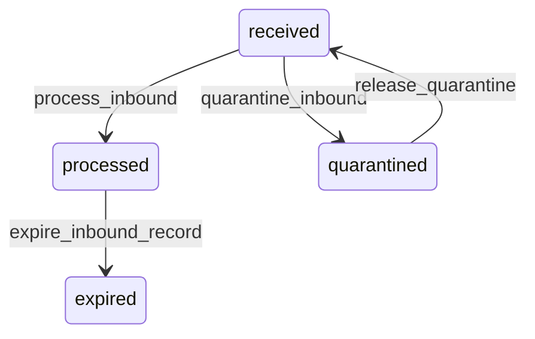

# State machine — Inbound Request

*Generated. Edit `_model/capabilities/integrations.yaml`, not this file.*

## Transition matrix

| From \\ To | `received` | `processed` | `quarantined` | `expired` |
|---|---|---|---|---|
| **`received`** | · | `process_inbound` | `quarantine_inbound` | — |
| **`processed`** | — | · | — | `expire_inbound_record` |
| **`quarantined`** | `release_quarantine` | — | · | — |
| **`expired`** | — | — | — | · |

Any transition marked `—` attempted at runtime returns `E_PRECONDITION`. It is never a silent no-op, because a silent no-op is how an operator believes work was recorded when it was not.

## Stuck-state policy

### `received`

Received and unprocessed means the inbound worker is not running while a far side believes it is being accepted. Threshold: inbound_processing_lag_seconds (default 30). Told: platform_operator. Escape hatch: drain. Short by design, because many callers treat a slow response as a failure and retry, which multiplies the backlog.

### `processed`

Terminal until retention. The monitored condition is the outcome mix: a connection whose rejected_validation rate exceeds inbound_rejection_alert (default 0.1) is a far side sending something the mapping does not expect, which is a conversation to have rather than a queue to drain. Told: the owner, daily.

### `quarantined`

Quarantine exists so that a broken feed produces one conversation rather than ten thousand rejections. Threshold: quarantine_review_hours (default 4). Told: the connection owner and platform_operator, with a representative sample rather than the whole set. Escape hatch: correct the mapping and release, or disable the connection. Nothing expires from quarantine automatically, because the messages in it are usually the ones somebody most wants to recover.

### `expired`

Terminal. Metadata retained, payload gone. Nothing pends.

