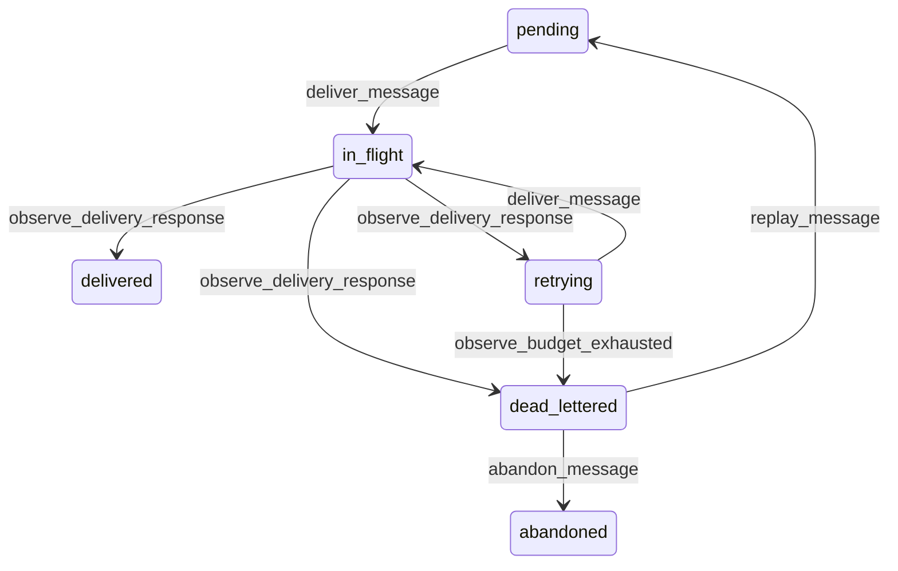

# State machine — Outbound Message

*Generated. Edit `_model/capabilities/integrations.yaml`, not this file.*

## Transition matrix

| From \\ To | `pending` | `in_flight` | `delivered` | `retrying` | `dead_lettered` | `abandoned` |
|---|---|---|---|---|---|---|
| **`pending`** | · | `deliver_message` | — | — | — | — |
| **`in_flight`** | — | · | `observe_delivery_response` | `observe_delivery_response` | `observe_delivery_response` | — |
| **`delivered`** | — | — | · | — | — | — |
| **`retrying`** | — | `deliver_message` | — | · | `observe_budget_exhausted` | — |
| **`dead_lettered`** | `replay_message` | — | — | — | · | `abandon_message` |
| **`abandoned`** | — | — | — | — | — | · |

Any transition marked `—` attempted at runtime returns `E_PRECONDITION`. It is never a silent no-op, because a silent no-op is how an operator believes work was recorded when it was not.

## Stuck-state policy

### `pending`

Pending and undelivered means the dispatcher is not running while events are being produced. Threshold: dispatch_lag_minutes (default 2). Told: platform_operator, because it is machinery. Escape hatch: drain. A short threshold is warranted because outbound integration is frequently how a counterparty learns something, and a two-hour delay is indistinguishable to them from not being told.

### `in_flight`

Bounded by the request timeout. The monitored exception is a message in flight beyond twice the connection timeout, which means a worker died mid-request and the far side may or may not have received it. It returns to retrying, and the receiver's own deduplication on the stable id is what makes that safe - which is why the id contract is stated as a contract rather than as a convention.

### `delivered`

Terminal. Retained for the audit period as the record of what was sent and when, which is what a reconciliation with the far side reads. Nothing pends.

### `retrying`

Bounded by the retry budget. The monitored condition is the aggregate rather than the individual: a connection with more than retrying_depth_alert messages in retry (default 100) is a remote system that is down rather than flaky, and telling somebody about one message when a thousand are failing is noise. Told: the owner, once per connection per interval, with the count and the far side's most common error.

### `dead_lettered`

This is the queue that decides whether integration failures are handled or merely logged. Threshold: dead_letter_review_hours (default 4), then daily, escalating to tenant_admin and then tenant_owner. Told: the connection owner, with the count grouped by error rather than one message at a time, because a person can act on a group and cannot read four hundred individual failures. Where any dead letter carries a billable outcome or an attendance record, finance and ops_manager are told separately and immediately, because those are revenue and pay. Escape hatch: replay after fixing the condition, or abandon explicitly. Nothing expires from this state on a timer.

### `abandoned`

Terminal. Payload retained permanently with the reason and the abandoning principal. The monitored condition is the aggregate - abandonment above a rate is somebody clearing a queue rather than fixing a problem, and it is reported to tenant_owner.

