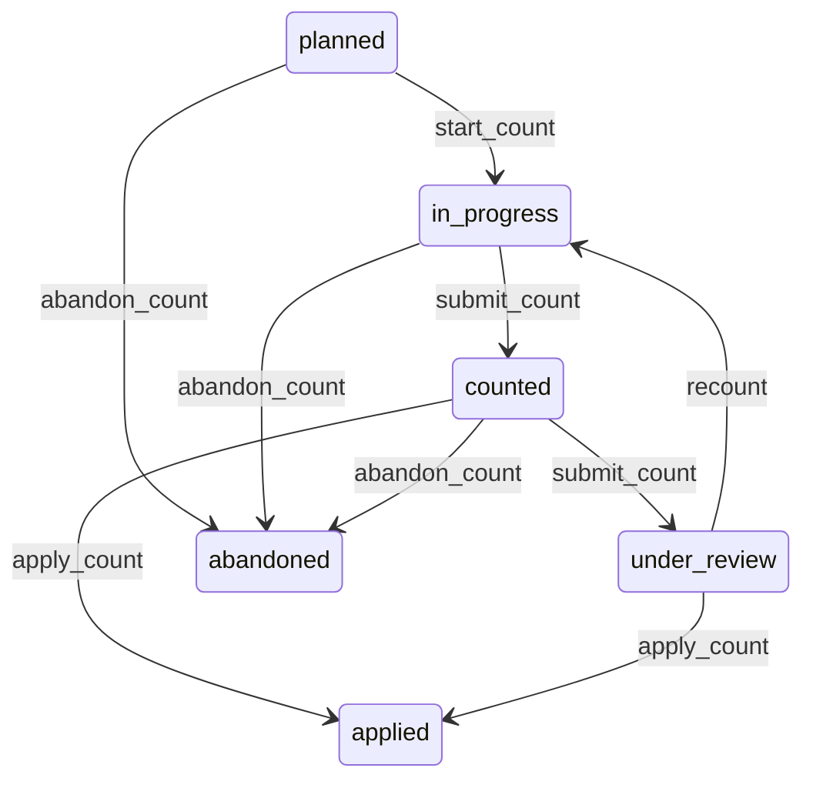

# State machine — Stock Count

*Generated. Edit `_model/capabilities/inventory.yaml`, not this file.*

## Transition matrix

| From \\ To | `planned` | `in_progress` | `counted` | `under_review` | `applied` | `abandoned` |
|---|---|---|---|---|---|---|
| **`planned`** | · | `start_count` | — | — | — | `abandon_count` |
| **`in_progress`** | — | · | `submit_count` | — | — | `abandon_count` |
| **`counted`** | — | — | · | `submit_count` | `apply_count` | `abandon_count` |
| **`under_review`** | — | `recount` | — | · | `apply_count` | — |
| **`applied`** | — | — | — | — | · | — |
| **`abandoned`** | — | — | — | — | — | · |

Any transition marked `—` attempted at runtime returns `E_PRECONDITION`. It is never a silent no-op, because a silent no-op is how an operator believes work was recorded when it was not.

## Stuck-state policy

### `planned`

Threshold: planned_count_stale_days (default 14). Told: the planning principal and the location custodian. Escape hatch: start or abandon. A planned count that never starts is a control that exists on paper only, and the location's uncounted-days monitor keeps running underneath it.

### `in_progress`

A count in progress freezes an expectation that becomes staler by the hour. Threshold: count_in_progress_alert_hours (default 8), and a hard alert at count_stale_hours (default 48) after which the variance is dominated by movement-since rather than by anything the counter found. Told: the counter, then the supervisor. Escape hatch: submit, recount with a fresh snapshot, or abandon. Verity never auto-submits a partial count, because a partial count applied as though complete writes corrections for items nobody looked at.

### `counted`

Submitted and not applied is a discrepancy that has been found and not acted on. Threshold: count_review_days (default 3). Told: the reviewer, then ops_manager. Escape hatch: apply, recount, or abandon with a reason. Never auto-applied above the threshold variance, because auto-applying a large variance writes off value without a person having agreed to it.

### `under_review`

Threshold: count_review_days as above, escalating to finance where the variance value exceeds the finance notification threshold. Told: the reviewer and finance. Escape hatch: apply or recount. The specific case worth naming is a review nobody completes because the variance is uncomfortable, and the escalation exists for exactly that.

### `applied`

Terminal. Retained permanently. The monitored condition is the same location showing a variance in the same direction across consecutive counts, which is a systematic loss rather than a counting error, and is the single most valuable output of this entity. Told: ops_manager and finance.

### `abandoned`

Terminal. Retained with the reason, and abandoned counts that had reached counted are reported separately to ops_manager, because discarding a discrepancy somebody found is the act that most needs a witness.

