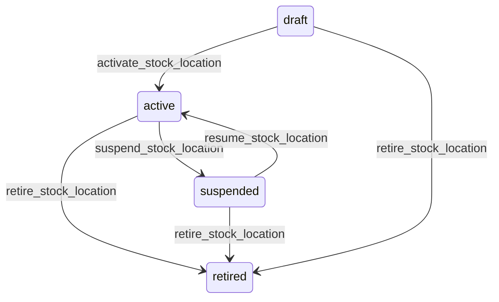

# State machine — Stock Location

*Generated. Edit `_model/capabilities/inventory.yaml`, not this file.*

## Transition matrix

| From \\ To | `draft` | `active` | `suspended` | `retired` |
|---|---|---|---|---|
| **`draft`** | · | `activate_stock_location` | — | `retire_stock_location` |
| **`active`** | — | · | `suspend_stock_location` | `retire_stock_location` |
| **`suspended`** | — | `resume_stock_location` | · | `retire_stock_location` |
| **`retired`** | — | — | — | · |

Any transition marked `—` attempted at runtime returns `E_PRECONDITION`. It is never a silent no-op, because a silent no-op is how an operator believes work was recorded when it was not.

## Stuck-state policy

### `draft`

Threshold: draft_location_stale_days (default 14). Told: the creating principal. Escape hatch: activate or retire. Low risk, and the characteristic confusion is somebody having set up a store during onboarding and finding it absent from every picker.

### `active`

Three monitored exceptions. (a) A location with a non-zero balance never counted for uncounted_location_days (default 180) - the balance is a claim nobody has checked and its age is the honest measure of how much it should be trusted. Told: the custodian and ops_manager. (b) A location holding a persistent negative balance for longer than negative_balance_alert_hours (default 24), which means consumption has been recorded against stock that was never received. Told: the custodian and ops_manager, and this is the most actionable signal in the capability because the cause is almost always a missing receipt. (c) An in_transit location holding stock for longer than in_transit_alert_days (default 3) - stock that left one place and never arrived anywhere, which is the definition of a loss that nobody has yet noticed.

### `suspended`

Threshold: location_suspension_review_days (default 14). Told: the suspending principal and ops_manager. Escape hatch: resume or retire. A suspended location with a balance is stock the operation cannot use and is still paying for, and the review notification carries its valuation for exactly that reason.

### `retired`

Terminal. Retained permanently so historical movements resolve. Nothing pends.

