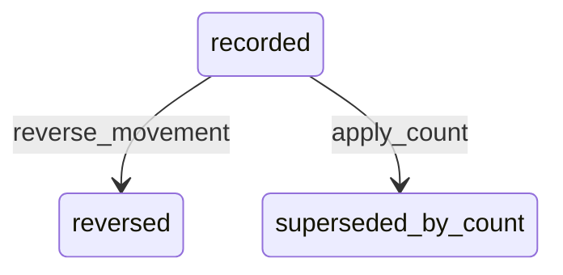

# State machine — Stock Movement

*Generated. Edit `_model/capabilities/inventory.yaml`, not this file.*

## Transition matrix

| From \\ To | `recorded` | `reversed` | `superseded_by_count` |
|---|---|---|---|
| **`recorded`** | · | `reverse_movement` | `apply_count` |
| **`reversed`** | — | · | — |
| **`superseded_by_count`** | — | — | · |

Any transition marked `—` attempted at runtime returns `E_PRECONDITION`. It is never a silent no-op, because a silent no-op is how an operator believes work was recorded when it was not.

## Stuck-state policy

### `recorded`

A movement is a fact and does not pend. Two conditions on the ledger as a whole are monitored here because there is nowhere better for them. (a) A movement whose occurred_at is more than late_movement_alert_hours (default 24) before its recorded_at - stock activity being reported long after it happened, which makes every balance in between wrong retrospectively. Told: ops_manager, with the affected items and the window. (b) A movement of kind adjustment exceeding adjustment_value_alert_minor in a rolling day for one location (default is a tenant-set money threshold). Told: finance and ops_manager. Adjustments are where a stock system is bent to match a spreadsheet, and the value rather than the count is what makes that visible.

### `reversed`

Terminal. The row and its reversal are both retained permanently. The monitored condition is a pattern - reversals by one principal exceeding reversal_rate_alert of their movements (default 0.05) - told to ops_manager. Individually a reversal is an honest correction; concentrated, it is either a broken capture flow or somebody adjusting stock to match what they want it to be.

### `superseded_by_count`

Terminal. Retained. Marking rather than deleting is what allows a count to be analysed as a boundary - how much drift accumulated before it, and whether the same drift resumes after it, which is the only way to tell a counting problem from a shrinkage problem. Nothing pends.

