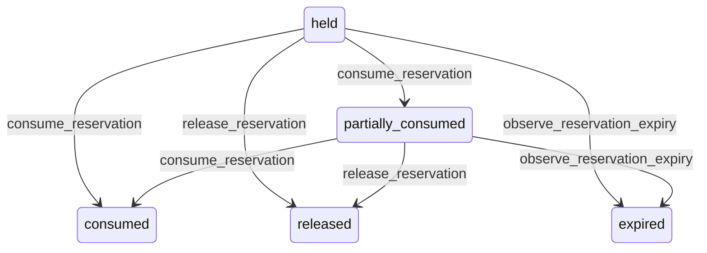

# State machine — Stock Reservation

*Generated. Edit `_model/capabilities/inventory.yaml`, not this file.*

## Transition matrix

| From \\ To | `held` | `partially_consumed` | `consumed` | `released` | `expired` |
|---|---|---|---|---|---|
| **`held`** | · | `consume_reservation` | `consume_reservation` | `release_reservation` | `observe_reservation_expiry` |
| **`partially_consumed`** | — | · | `consume_reservation` | `release_reservation` | `observe_reservation_expiry` |
| **`consumed`** | — | — | · | — | — |
| **`released`** | — | — | — | · | — |
| **`expired`** | — | — | — | — | · |

Any transition marked `—` attempted at runtime returns `E_PRECONDITION`. It is never a silent no-op, because a silent no-op is how an operator believes work was recorded when it was not.

## Stuck-state policy

### `held`

The most damaging quiet state in the capability: stock that is unavailable to everybody and used by nobody. Threshold: any reservation with no expires_at held longer than open_reservation_alert_days (default 7), and any expired-eligible reservation not swept within reservation_sweep_lag_minutes (default 15). Told: the claiming source''s owner and ops_manager for the first; platform_operator for the second, because an unswept expiry is machinery rather than operations. Escape hatch: consume, release, or set an expiry. Verity never auto-releases an unexpiring reservation, because releasing stock somebody is relying on produces a shortage at the moment of use.

### `partially_consumed`

Same thresholds as held, applied to the remainder. The specific monitored case is a partial consumption where the source has already completed - the remainder is stranded and will never be consumed. Detected by asking the source through the port whether it is still live, rather than by a timer, because a timer would release stock from a long-running job that genuinely still needs it.

### `consumed`

Terminal. Retained, because the link between a reservation and its movement is what allows a commitment to be traced from claim to consumption. Nothing pends.

### `released`

Terminal. Retained with the reason. The monitored condition is a pattern - a source that reserves and releases repeatedly without consuming, which is usually a workflow creating reservations too early. Told: ops_manager, monthly.

### `expired`

Terminal. Retained. A high expiry rate means reservations are being made with windows shorter than the work actually takes, which produces a shortage exactly when the work finally starts. Reported alongside the released rate for the same reason.

