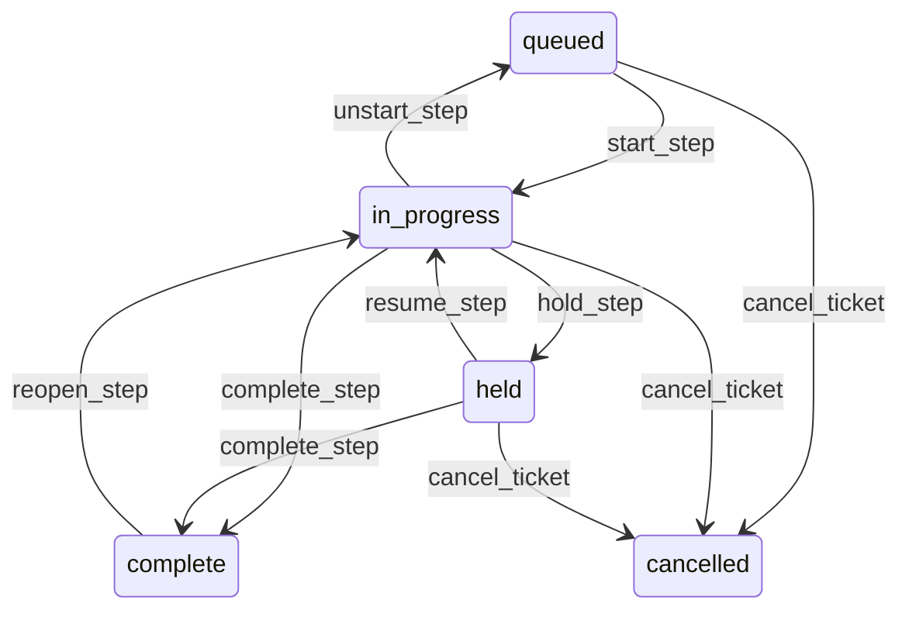

# State machine — Preparation Step

*Generated. Edit `_model/capabilities/kitchen_flow.yaml`, not this file.*

## Transition matrix

| From \\ To | `queued` | `in_progress` | `held` | `complete` | `cancelled` |
|---|---|---|---|---|---|
| **`queued`** | · | `start_step` | — | — | `cancel_ticket` |
| **`in_progress`** | `unstart_step` | · | `hold_step` | `complete_step` | `cancel_ticket` |
| **`held`** | — | `resume_step` | · | `complete_step` | `cancel_ticket` |
| **`complete`** | — | `reopen_step` | — | · | — |
| **`cancelled`** | — | — | — | — | · |

Any transition marked `—` attempted at runtime returns `E_PRECONDITION`. It is never a silent no-op, because a silent no-op is how an operator believes work was recorded when it was not.

## Stuck-state policy

### `queued`

A step waiting while its station has capacity is either a busy moment or a station nobody is at. Threshold: queued_alert_seconds (default 120), or the projected lateness of its ticket, whichever comes first. Told: the station display itself first, by moving the step to the top and marking it, which is the only notification that reliably reaches somebody with both hands full. Then the supervisor. Escape hatch: start it, or reassign the step to another station with matching tags.

### `in_progress`

Threshold: expected_seconds multiplied by overrun_alert_multiple (default 2), or step_overrun_alert_seconds (default 600) where no expectation exists. Told: the station display, then the supervisor. Escape hatch: complete, hold with a reason, or have a supervisor reassign. There is deliberately no automatic completion at any threshold. An automatic completion marks something as done that nobody did, and the request then leaves as ready with nothing behind it.

### `held`

A held step is late and known to be late, and the timer keeps running so that the lateness is honest. Threshold: hold_alert_seconds (default 300). Told: the supervisor with the hold reason, because a hold reason repeated across several steps is a supply problem rather than a preparation problem. Escape hatch: resume, complete, or cancel the ticket.

### `complete`

Terminal unless reopened. The reopen window is short by design. The monitored condition is a step completing far faster than its expectation - below implausible_speed_fraction of expected_seconds (default 0.1) - reported as a pattern rather than an instance, because a station where everything completes in two seconds is a station where somebody is clearing the screen rather than doing the work, and that is the most damaging failure a station display can have.

### `cancelled`

Terminal. Retained with any elapsed time already accrued. Nothing pends.

