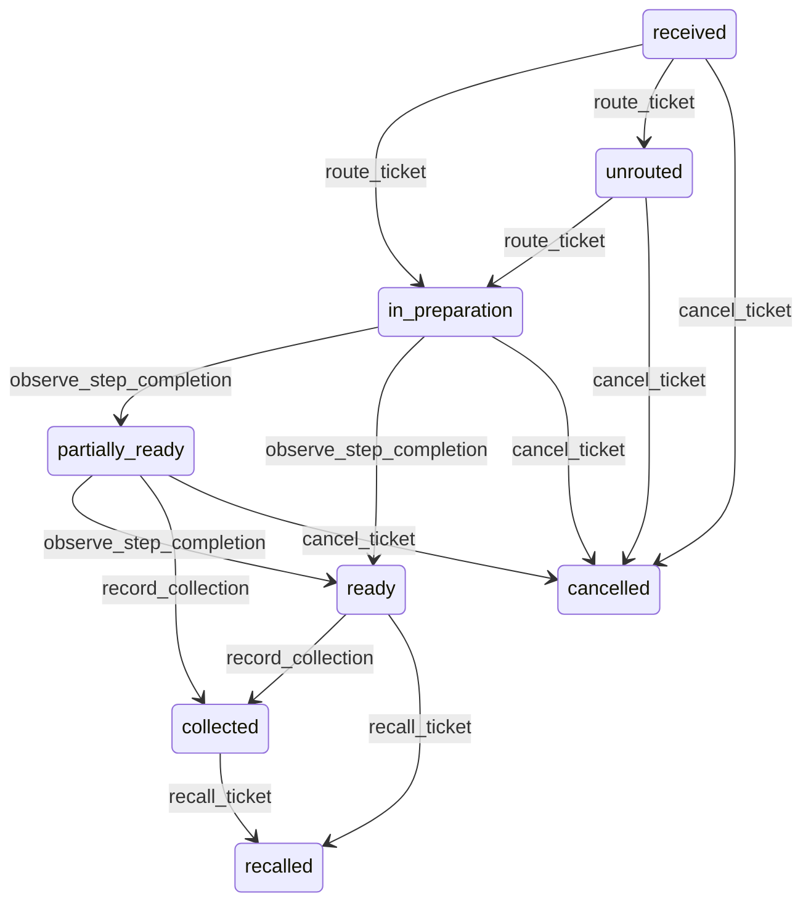

# State machine — Preparation Ticket

*Generated. Edit `_model/capabilities/kitchen_flow.yaml`, not this file.*

## Transition matrix

| From \\ To | `received` | `unrouted` | `in_preparation` | `partially_ready` | `ready` | `collected` | `recalled` | `cancelled` |
|---|---|---|---|---|---|---|---|---|
| **`received`** | · | `route_ticket` | `route_ticket` | — | — | — | — | `cancel_ticket` |
| **`unrouted`** | — | · | `route_ticket` | — | — | — | — | `cancel_ticket` |
| **`in_preparation`** | — | — | · | `observe_step_completion` | `observe_step_completion` | — | — | `cancel_ticket` |
| **`partially_ready`** | — | — | — | · | `observe_step_completion` | `record_collection` | — | `cancel_ticket` |
| **`ready`** | — | — | — | — | · | `record_collection` | `recall_ticket` | — |
| **`collected`** | — | — | — | — | — | · | `recall_ticket` | — |
| **`recalled`** | — | — | — | — | — | — | · | — |
| **`cancelled`** | — | — | — | — | — | — | — | · |

Any transition marked `—` attempted at runtime returns `E_PRECONDITION`. It is never a silent no-op, because a silent no-op is how an operator believes work was recorded when it was not.

## Stuck-state policy

### `received`

Received and unrouted for more than routing_lag_seconds (default 10) means the routing machinery is not running while requests are arriving. Told: the location supervisor AND platform_operator, because the two possible causes - no matching station open, and the router being down - look identical from the floor and have completely different fixes. Threshold in seconds, because a preparation operation measured in minutes cannot absorb a routing delay measured in minutes.

### `unrouted`

The loudest condition in this capability. A request has been accepted and nothing is being prepared. Threshold: immediate on entry, repeated every unrouted_repeat_seconds (default 60) until resolved. Told: the location supervisor on the floor surface, with the specific lines and the tags that matched nothing. Escape hatch: open a station, assign manually, or cancel. Never resolved automatically by routing to the nearest station, because a line prepared at the wrong station is worse than one nobody started - it consumes capacity and produces the wrong thing.

### `in_preparation`

Bounded by the steps. The monitored exception is a ticket whose slowest step will miss target_ready_at, computed continuously rather than at the deadline. Threshold: when projected completion exceeds target_ready_at by more than lateness_alert_seconds (default 120). Told: the station holding the slow step, then the supervisor. Escape hatch: expedite, reassign, or change the coordination mode so that the ready parts can leave. Projecting rather than waiting is the whole point, because at the deadline nothing can be done.

### `partially_ready`

Parts are finished and waiting, losing condition or occupying space, while other parts are still being prepared. Threshold: partial_wait_alert_seconds (default 180) from the first part becoming ready. Told: the station holding the outstanding steps and the supervisor. Escape hatch: finish, release the ready parts, or re-ticket the remainder. This state is where a coordination failure actually costs something, and it is deliberately measured from the first part rather than from the ticket start.

### `ready`

Finished and uncollected. Threshold: uncollected_alert_seconds (default 120), then every minute. Told: whoever collects, then the supervisor. Escape hatch: collect, or recall as unusable with a reason. This is the state where preparation work quietly degrades and the loss is invisible unless it is measured, so the elapsed time between ready_at and collected_at is retained on every ticket and reported.

### `collected`

Terminal. Retained. The one thing still pending is the source acknowledgement - a collected ticket whose source has not been told within source_ack_seconds (default 30) is reported to platform_operator, because a source that believes work is still in preparation will not release the request.

### `recalled`

Terminal on this ticket; the successor carries the work. The monitored condition is a chain - more than recall_chain_alert recalls in sequence (default 1) - told to the supervisor and ops_manager immediately rather than as a pattern, because a second recall of the same request means something is wrong that another attempt will not fix.

### `cancelled`

Terminal. Retained with the reason and with the cost of any work already done, recorded as produced-and-cancelled. Absorbing that cost silently means the operation never learns what late cancellation costs it. Nothing pends.

