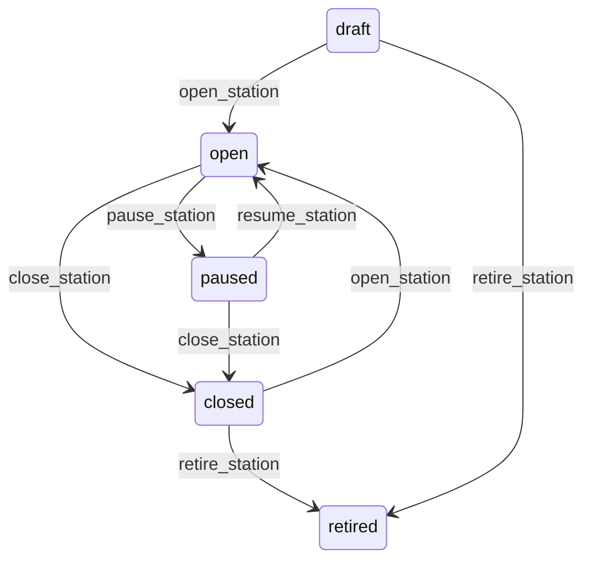

# State machine — Station

*Generated. Edit `_model/capabilities/kitchen_flow.yaml`, not this file.*

## Transition matrix

| From \\ To | `draft` | `open` | `paused` | `closed` | `retired` |
|---|---|---|---|---|---|
| **`draft`** | · | `open_station` | — | — | `retire_station` |
| **`open`** | — | · | `pause_station` | `close_station` | — |
| **`paused`** | — | `resume_station` | · | `close_station` | — |
| **`closed`** | — | `open_station` | — | · | `retire_station` |
| **`retired`** | — | — | — | — | · |

Any transition marked `—` attempted at runtime returns `E_PRECONDITION`. It is never a silent no-op, because a silent no-op is how an operator believes work was recorded when it was not.

## Stuck-state policy

### `draft`

Threshold: draft_station_stale_days (default 7). Told: the creating principal and the location supervisor. Escape hatch: open or retire. The characteristic failure is a station configured during setup and never opened, so lines matching its tags queue unrouted and nobody knows why.

### `open`

Steady state. Three monitored exceptions, all in minutes because this is a live operation. (a) A station whose queue depth exceeds concurrent_capacity multiplied by queue_depth_alert_multiple (default 3) for longer than queue_depth_alert_minutes (default 5) - it is overwhelmed and every request behind it is late. Told: the location supervisor on the floor, in place, not by email. (b) A station whose display device has not been seen for display_heartbeat_seconds (default 90) - the screen is dark and the work on it is invisible. Told: the supervisor immediately; this is the failure that produces requests nobody prepares. (c) A station with an open queue and no step started for idle_with_queue_minutes (default 5), which is somebody having walked away from a station that has work on it.

### `paused`

Threshold: station_pause_review_minutes (default 15). Told: the pausing principal and the supervisor. Escape hatch: resume or close. A paused station is routing work elsewhere or leaving it unrouted, and either way the effect compounds by the minute, which is why the threshold is a quarter of an hour rather than a day.

### `closed`

Not a queue in itself. The monitored exception is lines routing to no open station at all, which is reported against the location rather than against any one station - see the preparation_ticket unrouted policy, which is where that condition lives.

### `retired`

Terminal. Retained permanently so a historical ticket resolves to where it was prepared. Nothing pends.

