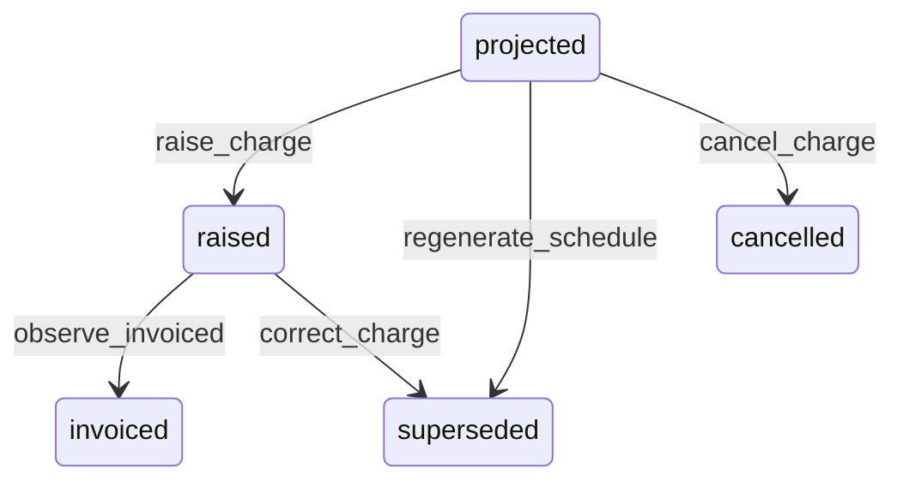

# State machine — Charge Schedule

*Generated. Edit `_model/capabilities/lease_management.yaml`, not this file.*

## Transition matrix

| From \\ To | `projected` | `raised` | `invoiced` | `superseded` | `cancelled` |
|---|---|---|---|---|---|
| **`projected`** | · | `raise_charge` | — | `regenerate_schedule` | `cancel_charge` |
| **`raised`** | — | · | `observe_invoiced` | `correct_charge` | — |
| **`invoiced`** | — | — | · | — | — |
| **`superseded`** | — | — | — | · | — |
| **`cancelled`** | — | — | — | — | · |

Any transition marked `—` attempted at runtime returns `E_PRECONDITION`. It is never a silent no-op, because a silent no-op is how an operator believes work was recorded when it was not.

## Stuck-state policy

### `projected`

Bounded by the raise date. The monitored exception is a projected row whose raise date has passed while the lease is active - rent that should have been charged and was not. Threshold: raise_lag_days (default 1). Told: finance AND platform_operator, because a scheduler that is not running and a lease that is not active look identical in a report and have completely different fixes. This is the highest-value monitor in the capability, since unraised rent is invisible by construction.

### `raised`

Raised and uninvoiced is revenue asked for by nobody. Threshold: invoice_lag_days (default 5). Told: finance. Escape hatch: invoice, or investigate the billing sink. The specific case worth naming is a raised charge whose billable outcome was never acknowledged, which is the same divergence billing watches for from its own side.

### `invoiced`

Terminal in schedule terms. Collection, dispute and write-off all belong to billing. Nothing pends here, deliberately, because two capabilities both chasing the same debt produce two conversations with one counterparty.

### `superseded`

Terminal. Retained permanently with its basis note, because a superseded charge is exactly what a counterparty produces when they query a correction. Nothing pends.

### `cancelled`

Terminal. Retained with the reason. Nothing pends.

