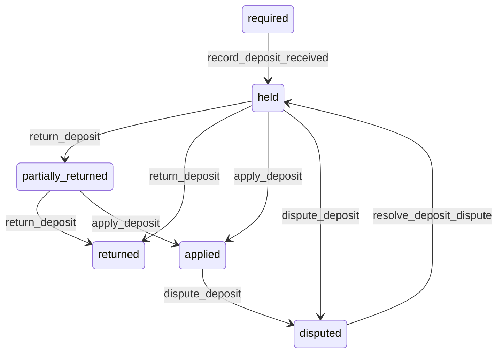

# State machine — Deposit

*Generated. Edit `_model/capabilities/lease_management.yaml`, not this file.*

## Transition matrix

| From \\ To | `required` | `held` | `partially_returned` | `returned` | `applied` | `disputed` |
|---|---|---|---|---|---|---|
| **`required`** | · | `record_deposit_received` | — | — | — | — |
| **`held`** | — | · | `return_deposit` | `return_deposit` | `apply_deposit` | `dispute_deposit` |
| **`partially_returned`** | — | — | · | `return_deposit` | `apply_deposit` | — |
| **`returned`** | — | — | — | · | — | — |
| **`applied`** | — | — | — | — | · | `dispute_deposit` |
| **`disputed`** | — | `resolve_deposit_dispute` | — | — | — | · |

Any transition marked `—` attempted at runtime returns `E_PRECONDITION`. It is never a silent no-op, because a silent no-op is how an operator believes work was recorded when it was not.

## Stuck-state policy

### `required`

A required and unreceived deposit is an unsecured occupation. Threshold: deposit_chase_days (default 14) from lease start. Told: finance and the relationship owner. Escape hatch: collect, or record that it was waived. Verity never assumes a waiver from silence, because an unrecorded waiver is discovered at the end of the term when there is nothing to return and nothing to apply.

### `held`

Steady state during the term. Two monitored exceptions. (a) A deposit whose holding arrangement is not_stated for arrangement_chase_days (default 30) - nobody has recorded where somebody else's money is. (b) A third-party scheme arrangement with no scheme reference, which usually means the protection step was never completed and is a compliance exposure rather than an administrative one. Told: finance and tenant_owner.

### `partially_returned`

Threshold: the return deadline. Told: finance and the counterparty, with the retained amount and the reason. Escape hatch: return the remainder or apply it explicitly. A partial return with an unexplained retention is the shape of a dispute waiting to happen, and stating the reason at the moment of retention is what prevents it.

### `returned`

Terminal. Retained permanently with the return evidence, because a returned deposit is the thing most often claimed not to have been returned. Nothing pends.

### `applied`

Terminal unless disputed. Retained with the calculation given to the counterparty. The monitored condition is application without a prior notification, which should be impossible by the guard and whose occurrence is a defect alert.

### `disputed`

Threshold: deposit_dispute_days (default 30), escalating to tenant_owner. Told: both parties. Escape hatch: resolve. No expiry, for the same reason as every other dispute in the platform - an expiring dispute resolves in favour of whoever holds the money, and here that is always the tenant of Verity rather than their counterparty.

