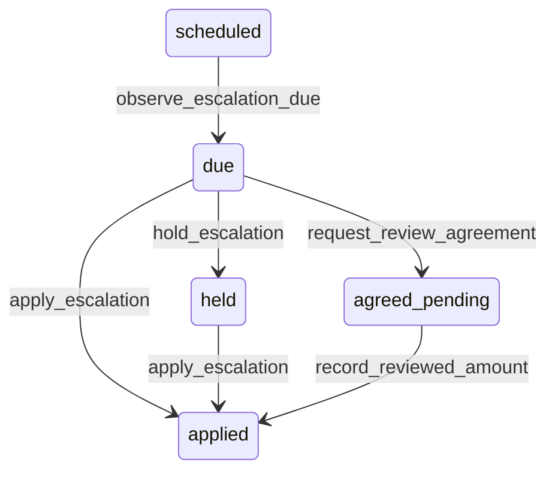

# State machine — Escalation Rule

*Generated. Edit `_model/capabilities/lease_management.yaml`, not this file.*

## Transition matrix

| From \\ To | `scheduled` | `due` | `applied` | `held` | `agreed_pending` |
|---|---|---|---|---|---|
| **`scheduled`** | · | `observe_escalation_due` | — | — | — |
| **`due`** | — | · | `apply_escalation` | `hold_escalation` | `request_review_agreement` |
| **`applied`** | — | — | · | — | — |
| **`held`** | — | — | `apply_escalation` | · | — |
| **`agreed_pending`** | — | — | `record_reviewed_amount` | — | · |

Any transition marked `—` attempted at runtime returns `E_PRECONDITION`. It is never a silent no-op, because a silent no-op is how an operator believes work was recorded when it was not.

## Stuck-state policy

### `scheduled`

Bounded by next_due_on. Not otherwise monitored; the lease's own escalation warning carries the advance notice.

### `due`

An escalation due and unapplied is money not being charged, accruing every period. Threshold: escalation_apply_lag_days (default 7). Told: finance and tenant_owner, with the cumulative under-recovery to date, because that number is what makes it urgent. Escape hatch: apply, hold explicitly, or start the review.

### `applied`

Terminal for that effective date. Where the rule has further effective dates it returns to scheduled for the next. Retained with its computation so a charge can always be traced to the rule and the inputs that produced it.

### `held`

Held is legitimate for an unpublished index and dangerous as a resting place. Threshold: escalation_hold_review_days (default 30), then monthly. Told: finance, with the accrued difference. Escape hatch: apply once the input arrives, or record a deliberate decision not to escalate. The accrued difference is shown on every notification so that the cost of continuing to hold is visible rather than theoretical.

### `agreed_pending`

A review under negotiation, which frequently runs long. Threshold: review_negotiation_days (default 90), then monthly, escalating to tenant_owner. Told: finance and the relationship owner, with the accrued difference at the old amount. Escape hatch: agree, or invoke whatever determination the agreement provides for. Verity never imposes a reviewed amount, because a reviewed amount is a negotiated fact and imposing one would produce a charge with no basis a counterparty accepts.

