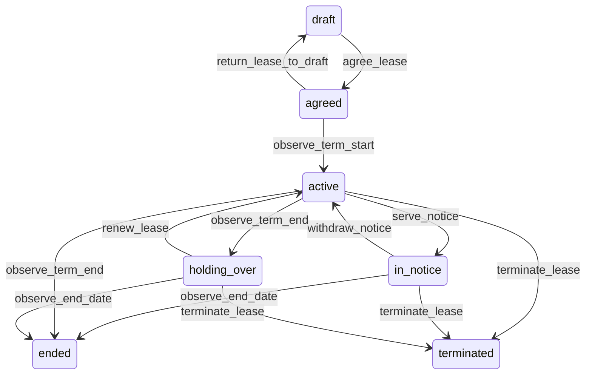

# State machine — Lease

*Generated. Edit `_model/capabilities/lease_management.yaml`, not this file.*

## Transition matrix

| From \\ To | `draft` | `agreed` | `active` | `in_notice` | `holding_over` | `ended` | `terminated` |
|---|---|---|---|---|---|---|---|
| **`draft`** | · | `agree_lease` | — | — | — | — | — |
| **`agreed`** | `return_lease_to_draft` | · | `observe_term_start` | — | — | — | — |
| **`active`** | — | — | · | `serve_notice` | `observe_term_end` | `observe_term_end` | `terminate_lease` |
| **`in_notice`** | — | — | `withdraw_notice` | · | — | `observe_end_date` | `terminate_lease` |
| **`holding_over`** | — | — | `renew_lease` | — | · | `observe_end_date` | `terminate_lease` |
| **`ended`** | — | — | — | — | — | · | — |
| **`terminated`** | — | — | — | — | — | — | · |

Any transition marked `—` attempted at runtime returns `E_PRECONDITION`. It is never a silent no-op, because a silent no-op is how an operator believes work was recorded when it was not.

## Stuck-state policy

### `draft`

Threshold: draft_lease_stale_days (default 30). Told: the drafting principal and finance. Escape hatch: agree or discard. The specific risk is a counterparty already in occupation under terms that exist only in a draft, so the notification asks whether the space is already occupied.

### `agreed`

Bounded by starts_on. The monitored exception is an agreed lease whose start date has passed without the scheduler activating it, which means charges are not being raised while somebody is occupying space. Threshold: activation_lag_days (default 1). Told: finance and platform_operator, because the two causes look identical from a report.

### `active`

Steady state and where every date-driven obligation lives. Four monitored conditions. (a) A renewal window opening within renewal_warning_days (default 180, or the notice period plus 60 where that is longer). Told: finance, the relationship owner and tenant_owner, at the window opening, at halfway, at 30 days and at 7 days before it closes. A renewal window that closes silently is an automatic renewal nobody chose, or a vacancy nobody planned for. (b) An escalation due within escalation_warning_days (default 90) that has not been calculated. (c) A lease with arrears exceeding arrears_alert_periods (default 2) of the base amount. (d) A lease with no executed document attached after document_chase_days (default 60), which is an agreement nobody can produce if it is disputed.

### `in_notice`

Bounded by the notice end date, and it is the period in which everything must be arranged. Threshold: notifications at notice service, at halfway, at 30 days and at 7 days, carrying the reinstatement obligations, the deposit return deadline and the vacancy that follows. Told: finance, the relationship owner and the space owner. Escape hatch: withdraw the notice by agreement, or proceed. The characteristic failure is a space becoming empty on a date nobody planned around.

### `holding_over`

The most commercially dangerous state, because it looks like continuity and is frequently an agreement with no agreed terms. Threshold: holding_over_review_days (default 30), then monthly, escalating to tenant_owner. Told: finance and tenant_owner, and the notification states plainly whether the agreement specifies a holding-over basis or whether charges are continuing on an assumption. Escape hatch: renew, serve notice, or terminate. Verity never assumes a holding-over rent where the agreement is silent; it continues at the last basis and flags the assumption on every charge raised, so an eventual dispute is about a number somebody can see was assumed.

### `ended`

Terminal in occupation terms. Two obligations pend. (a) The deposit return, which has a deadline and is monitored by its own entity. (b) Any reinstatement or final reconciliation, threshold final_reconciliation_days (default 90). Told: finance. Escape hatch: complete the reconciliation and return or apply the deposit. A lease ended with an unreturned deposit and no reconciliation is somebody else's money held with no stated reason.

### `terminated`

Terminal. Retained permanently with the reason, the effective date and the stated legal basis. Arrears remain owed and the deposit position is frozen rather than resolved, because a termination is usually contested and resolving the deposit unilaterally forecloses the argument. Told once to finance and tenant_owner. Nothing further pends automatically.

