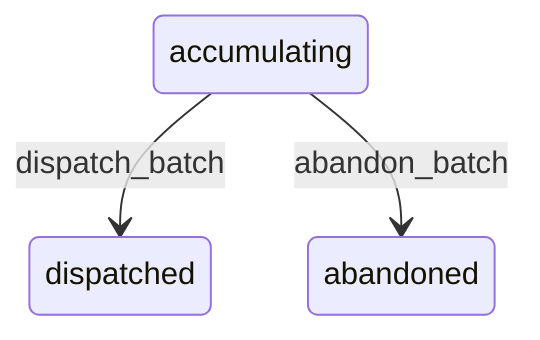

# State machine — Batch

*Generated. Edit `_model/capabilities/notification.yaml`, not this file.*

## Transition matrix

| From \\ To | `accumulating` | `dispatched` | `abandoned` |
|---|---|---|---|
| **`accumulating`** | · | `dispatch_batch` | `abandon_batch` |
| **`dispatched`** | — | · | — |
| **`abandoned`** | — | — | · |

Any transition marked `—` attempted at runtime returns `E_PRECONDITION`. It is never a silent no-op, because a silent no-op is how an operator believes work was recorded when it was not.

## Stuck-state policy

### `accumulating`

Bounded by window_end. The monitored exception is a batch whose window has ended and which has not dispatched within batch_dispatch_lag_minutes (default 5), meaning the scheduler is not running while people are waiting to be told things. Told: platform_operator. Escape hatch: dispatch manually. A second exception is a batch that has accumulated more than batch_size_alert members (default 50), which is usually a capability emitting per-row notifications for a bulk operation and is worth telling that capability's owner about rather than silently absorbing.

### `dispatched`

Terminal. Retained so the composition of a digest is reproducible when a recipient asks why they were told about something. Nothing pends.

### `abandoned`

Terminal. Retained with the reason. Nothing pends.

