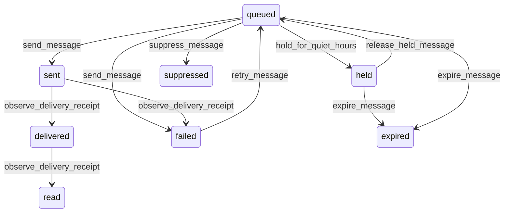

# State machine — Message

*Generated. Edit `_model/capabilities/notification.yaml`, not this file.*

## Transition matrix

| From \\ To | `queued` | `held` | `sent` | `delivered` | `read` | `failed` | `suppressed` | `expired` |
|---|---|---|---|---|---|---|---|---|
| **`queued`** | · | `hold_for_quiet_hours` | `send_message` | — | — | `send_message` | `suppress_message` | `expire_message` |
| **`held`** | `release_held_message` | · | — | — | — | — | — | `expire_message` |
| **`sent`** | — | — | · | `observe_delivery_receipt` | — | `observe_delivery_receipt` | — | — |
| **`delivered`** | — | — | — | · | `observe_delivery_receipt` | — | — | — |
| **`read`** | — | — | — | — | · | — | — | — |
| **`failed`** | `retry_message` | — | — | — | — | · | — | — |
| **`suppressed`** | — | — | — | — | — | — | · | — |
| **`expired`** | — | — | — | — | — | — | — | · |

Any transition marked `—` attempted at runtime returns `E_PRECONDITION`. It is never a silent no-op, because a silent no-op is how an operator believes work was recorded when it was not.

## Stuck-state policy

### `queued`

A queued message is something nobody has been told yet. Threshold: queue_lag_seconds (default 60) for priority critical and high, queue_lag_minutes (default 10) otherwise. Told: platform_operator, because a queue that is not draining is machinery. Escape hatch: drain, or fail over to a secondary provider. Critical and high priority messages deliberately have a threshold in seconds, because they include coverage risk, safety and security alerts whose value decays to nothing within minutes.

### `held`

Bounded by the end of the quiet window. The monitored exception is a message held so long that it will arrive after it matters - a shift reminder held past the shift. Threshold: the message's own relevance window where the originating capability declares one. Escape hatch: expire it and tell the originator, which is the model's choice, rather than sending it late. A reminder about something that has already happened is worse than no reminder, because it teaches the recipient that the messages are not worth reading.

### `sent`

Sent and unconfirmed. Threshold: receipt_wait_minutes (default 30) where the channel offers receipts. Told: nobody by notification - a notification about a notification is unreliable by construction - and the state is surfaced to the originating capability, which is where somebody is waiting for a response and can act.

### `delivered`

Terminal unless a read receipt follows. Retained for the audit period. Nothing pends.

### `read`

Terminal. Retained. Nothing pends.

### `failed`

Threshold: immediate. Told: the originating capability, and where the message was a reply or a request to a person, the principal waiting on the answer. This is the rule that matters most here: a bounced reply belongs to the assignee who believes they are being ignored, not to an operations queue nobody reads. Escape hatch: retry on an alternative channel, or contact the recipient another way. Never a silent retry on the same address, because the address is usually the problem.

### `suppressed`

Terminal. Retained rather than discarded, so the originating capability can see that nobody was told. The monitored condition is an originating capability whose messages are suppressed above suppression_rate_alert (default 0.2), which usually means it is sending marketing-class messages to people who only consented to transactional ones.

### `expired`

Terminal. Retained with the reason. The originator is told, because a capability that believes it notified somebody and did not will make a worse decision later.

