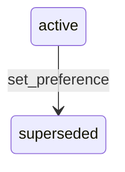

# State machine — Preference

*Generated. Edit `_model/capabilities/notification.yaml`, not this file.*

## Transition matrix

| From \\ To | `active` | `superseded` |
|---|---|---|
| **`active`** | · | `set_preference` |
| **`superseded`** | — | · |

Any transition marked `—` attempted at runtime returns `E_PRECONDITION`. It is never a silent no-op, because a silent no-op is how an operator believes work was recorded when it was not.

## Stuck-state policy

### `active`

Not a queue. Two monitored conditions. (a) A recipient who has disabled every channel for a category containing operationally significant messages, which is legitimate and means the originating capability must not rely on reaching them. This is reported to their supervisor once rather than repeatedly, because it is a fact to be known and not a problem to be fixed. (b) A recipient with no preference row at all for a category that is sending to them, which means they are on the pack default and have never been asked - reported in aggregate as a proportion, because a tenant where nobody has ever set a preference usually has a preferences screen nobody can find.

### `superseded`

Terminal. Retained, because what somebody chose and when is exactly what is asked about after a complaint that they were or were not contacted. Nothing pends.

