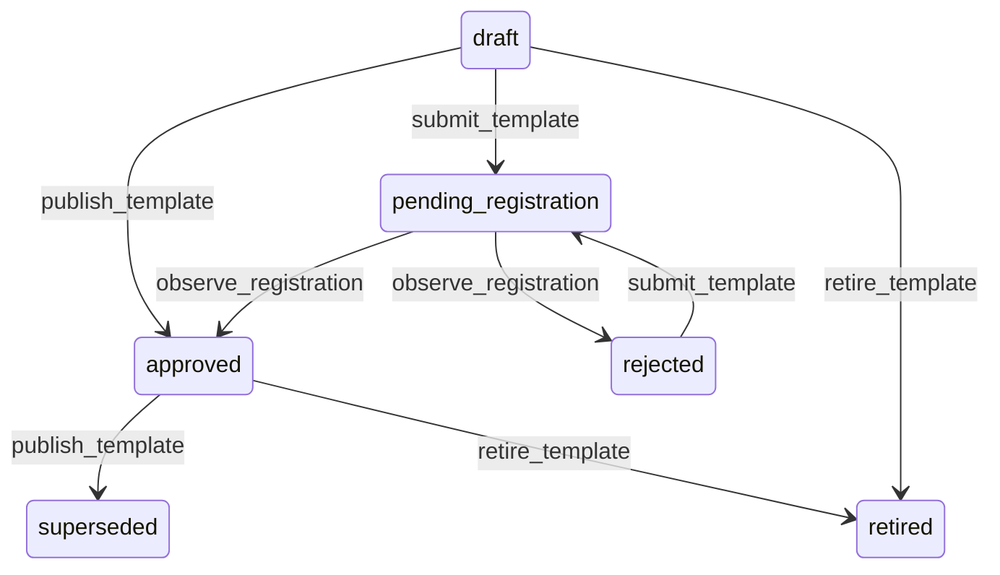

# State machine — Template

*Generated. Edit `_model/capabilities/notification.yaml`, not this file.*

## Transition matrix

| From \\ To | `draft` | `pending_registration` | `approved` | `rejected` | `superseded` | `retired` |
|---|---|---|---|---|---|---|
| **`draft`** | · | `submit_template` | `publish_template` | — | — | `retire_template` |
| **`pending_registration`** | — | · | `observe_registration` | `observe_registration` | — | — |
| **`approved`** | — | — | · | — | `publish_template` | `retire_template` |
| **`rejected`** | — | `submit_template` | — | · | — | — |
| **`superseded`** | — | — | — | — | · | — |
| **`retired`** | — | — | — | — | — | · |

Any transition marked `—` attempted at runtime returns `E_PRECONDITION`. It is never a silent no-op, because a silent no-op is how an operator believes work was recorded when it was not.

## Stuck-state policy

### `draft`

Threshold: draft_template_stale_days (default 14). Told: the author. Escape hatch: submit, publish or retire. The characteristic confusion is somebody having rewritten a message in response to a complaint and believing the new wording is going out.

### `pending_registration`

External approval is outside the tenant's control and takes as long as it takes. Threshold: registration_pending_days (default 3), then weekly. Told: the author and tenant_admin, and the notification states plainly that any rule depending on this template is currently sending nothing or falling back to another channel. Escape hatch: chase, or fall back. Verity never substitutes an approved template of different wording, because the wording is what was approved.

### `approved`

Steady state. Two monitored exceptions. (a) A template whose send failure rate exceeds template_failure_alert (default 0.1) - usually a variable rendering as empty or a length overflow on a channel that truncates. (b) A template of cost class marketing whose volume exceeds a tenant-set monthly threshold, told to tenant_owner with the spend, because marketing volume is the single largest controllable cost in this capability and nobody sees it until an invoice.

### `rejected`

Threshold: immediate. Told: the author with the registry's rejection reason verbatim, because those reasons are specific and paraphrasing them destroys the only actionable information. Escape hatch: amend and resubmit, or retire and route to another channel. A rejected template referenced by an active rule is escalated to tenant_admin, because that rule is silently failing.

### `superseded`

Terminal. Retained permanently, because a delivered message must remain reproducible exactly as it was sent when a recipient disputes what they were told. Nothing pends.

### `retired`

Terminal. Retained for the same reason. Nothing pends.

