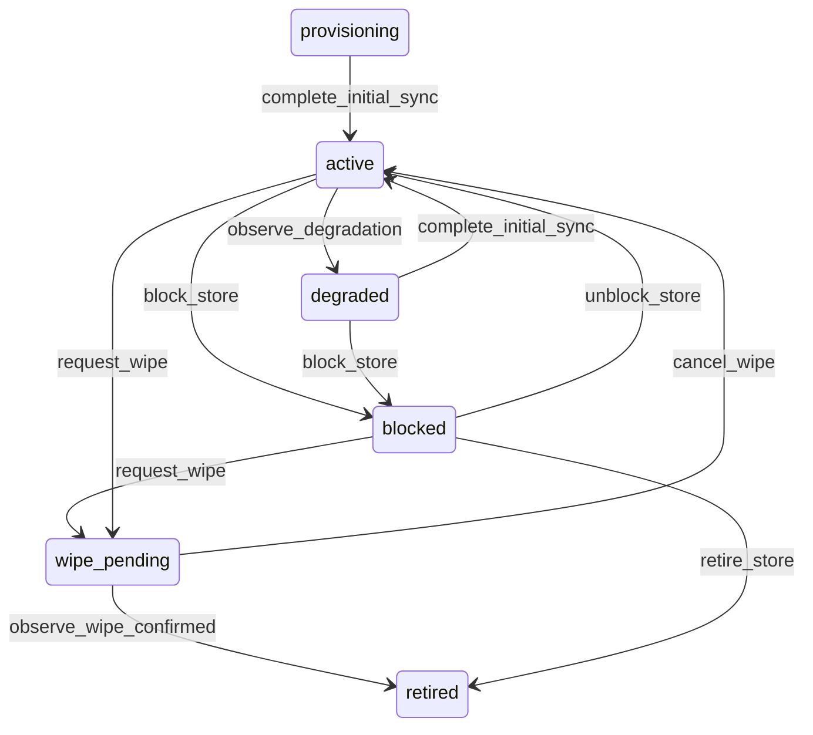

# State machine — Device Store

*Generated. Edit `_model/capabilities/offline_sync.yaml`, not this file.*

## Transition matrix

| From \\ To | `provisioning` | `active` | `degraded` | `blocked` | `wipe_pending` | `retired` |
|---|---|---|---|---|---|---|
| **`provisioning`** | · | `complete_initial_sync` | — | — | — | — |
| **`active`** | — | · | `observe_degradation` | `block_store` | `request_wipe` | — |
| **`degraded`** | — | `complete_initial_sync` | · | `block_store` | — | — |
| **`blocked`** | — | `unblock_store` | — | · | `request_wipe` | `retire_store` |
| **`wipe_pending`** | — | `cancel_wipe` | — | — | · | `observe_wipe_confirmed` |
| **`retired`** | — | — | — | — | — | · |

Any transition marked `—` attempted at runtime returns `E_PRECONDITION`. It is never a silent no-op, because a silent no-op is how an operator believes work was recorded when it was not.

## Stuck-state policy

### `provisioning`

A device that never completes its first sync is a person who cannot start. Threshold: provisioning_alert_minutes (default 30). Told: the principal on the device, and the supervisor of their location. Escape hatch: retry, reduce the scope, or provision on a better connection. The characteristic failure is an initial dataset too large for the connection at the location where the device will actually be used, which is precisely where it is being provisioned.

### `active`

Steady state. Four monitored conditions, and these are the observability that makes this capability worth having. (a) A store whose oldest_queued_at exceeds stranded_work_alert_hours (default 12) - somebody's work exists only on a handset. Told: the principal and their supervisor. (b) A store not seen for device_silence_alert_hours (default 24) while holding a non-empty queue - the most dangerous condition, because both the work and the device may be gone. Told: the supervisor, escalating daily. (c) A store whose queue depth exceeds queue_depth_alert (default 200), which usually means a device that has been offline for days and whose replay will be long and conflict-prone. (d) queued_financial_count above zero, told to platform_operator as a security finding.

### `degraded`

Threshold: degraded_alert_hours (default 24). Told: the principal and the supervisor, with the specific reason - version, staleness or storage - because the three have completely different remedies and a generic message produces a support call. Escape hatch: update, resync or free storage. A degraded store still pushes what it has queued, deliberately, because refusing to accept existing work over a version mismatch strands it permanently.

### `blocked`

A blocked store holds work that nobody has decided about. Threshold: immediate on entry. Told: the supervisor and tenant_admin, with the queue contents summarised by kind and by age. Escape hatch: unblock and review, or explicitly abandon with a reason recorded against each mutation. Verity never auto-discards a blocked queue and never auto-applies one. Auto-applying launders a suspended person's writes; auto-discarding destroys a day of legitimate work, and only a human can tell which case it is.

### `wipe_pending`

A wipe requested and unconfirmed means a device that may still hold data. Threshold: wipe_confirmation_hours (default 24), then daily. Told: tenant_admin and platform_operator. Escape hatch: none automatic. The store stays wipe_pending indefinitely rather than being presumed wiped, because presuming a wipe on a device that never returned is the exact opposite of what a security record should do.

### `retired`

Terminal. Retained permanently, with the record of any queue that was never recovered, because a supervisor asking what was lost with a handset must have an answer. Nothing pends.

