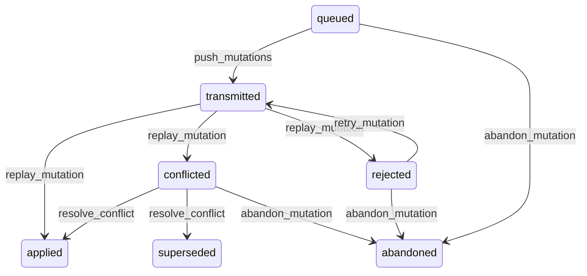

# State machine — Queued Mutation

*Generated. Edit `_model/capabilities/offline_sync.yaml`, not this file.*

## Transition matrix

| From \\ To | `queued` | `transmitted` | `applied` | `conflicted` | `rejected` | `abandoned` | `superseded` |
|---|---|---|---|---|---|---|---|
| **`queued`** | · | `push_mutations` | — | — | — | `abandon_mutation` | — |
| **`transmitted`** | — | · | `replay_mutation` | `replay_mutation` | `replay_mutation` | — | — |
| **`applied`** | — | — | · | — | — | — | — |
| **`conflicted`** | — | — | `resolve_conflict` | · | — | `abandon_mutation` | `resolve_conflict` |
| **`rejected`** | — | `retry_mutation` | — | — | · | `abandon_mutation` | — |
| **`abandoned`** | — | — | — | — | — | · | — |
| **`superseded`** | — | — | — | — | — | — | · |

Any transition marked `—` attempted at runtime returns `E_PRECONDITION`. It is never a silent no-op, because a silent no-op is how an operator believes work was recorded when it was not.

## Stuck-state policy

### `queued`

Bounded by connectivity and by nothing else. Threshold: stranded_work_alert_hours (default 12) from queued_at, and a second escalation at stranded_work_critical_hours (default 72) at which the owning records are marked as having work that may never arrive. Told: the acting principal first, because the fix is usually to walk somewhere with a signal, then the supervisor. Escape hatch: sync, or abandon explicitly. This is the state where real work is actually lost and every threshold here is set to make that visible before the device is dropped in a puddle.

### `transmitted`

A short mechanical window between arrival and replay. Threshold: replay_lag_minutes (default 5). Told: platform_operator. The device still shows the work as unconfirmed during this window, deliberately, because telling somebody their work is saved before it has been applied is a promise the platform may not be able to keep.

### `applied`

Terminal. Retained for the audit period as the record of what was done offline and when it arrived. The sync lag between occurred_at and applied_at is retained and queryable, because a fortnight of work arriving in one burst is the shape of both a broken handset and a fabrication.

### `conflicted`

A conflict is somebody's work waiting on a decision, and every hour it waits is an hour the two people involved remember the situation less clearly. Threshold: conflict_resolution_hours (default 8), escalating to the supervisor and then to ops_manager. Told: the acting principal and whoever made the competing change, both, because a conflict resolved by one party without the other knowing is how one of them later discovers their work vanished. Escape hatch: resolve. Never auto-resolved after any interval, because an expiring conflict resolves in favour of whoever was online.

### `rejected`

Rejected work is work the server will not accept and that the person believes is done. Threshold: immediate. Told: the acting principal with the specific reason in plain terms, and their supervisor. Escape hatch: correct and retry, or abandon with a reason. The single most important property here is that the reason reaches the person who did the work rather than an integration log, because they are the only one who knows what they meant.

### `abandoned`

Terminal. The payload and any evidence are retained permanently with the abandonment reason and the principal who abandoned it. This is the one place in the platform where somebody deliberately throws away recorded work, and it is the last place that should be untraceable.

### `superseded`

Terminal. The discarded device version is retained in full on the conflict record. Nothing pends.

