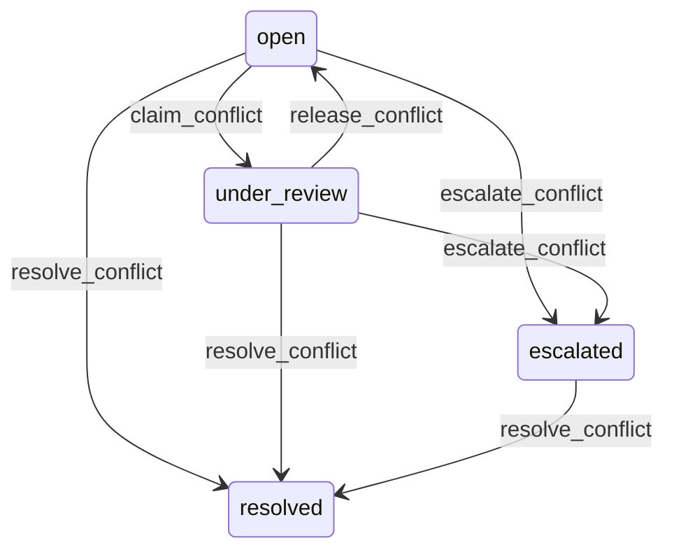

# State machine — Sync Conflict

*Generated. Edit `_model/capabilities/offline_sync.yaml`, not this file.*

## Transition matrix

| From \\ To | `open` | `under_review` | `resolved` | `escalated` |
|---|---|---|---|---|
| **`open`** | · | `claim_conflict` | `resolve_conflict` | `escalate_conflict` |
| **`under_review`** | `release_conflict` | · | `resolve_conflict` | `escalate_conflict` |
| **`resolved`** | — | — | · | — |
| **`escalated`** | — | — | `resolve_conflict` | · |

Any transition marked `—` attempted at runtime returns `E_PRECONDITION`. It is never a silent no-op, because a silent no-op is how an operator believes work was recorded when it was not.

## Stuck-state policy

### `open`

Threshold: conflict_claim_hours (default 4). Told: both parties. Escape hatch: claim and resolve. An unclaimed conflict is work in limbo that neither person can see the state of, and telling both is deliberate - a conflict where only one side knows is one where the other later discovers their change vanished.

### `under_review`

Threshold: conflict_resolution_hours (default 8), and the claim itself times out at conflict_claim_timeout_hours (default 24) and returns to open, so a reviewer who goes off shift does not park somebody's work indefinitely. Told: both parties, with the elapsed time.

### `resolved`

Terminal. Both versions retained permanently. The monitored condition is a pattern - a field that conflicts more than field_conflict_alert times in a period, which means its merge strategy is wrong or two roles are legitimately editing the same thing and the workflow needs changing. Told: the owning capability's owner, monthly. This is the only signal that ever causes a merge strategy to be corrected.

### `escalated`

Threshold: escalated_conflict_hours (default 24), then daily. Told: both parties and the escalation chain. Escape hatch: resolve. No expiry and no automatic resolution at any point, because an expiring conflict resolves in favour of whoever happened to be online, which is always the office rather than the field.

