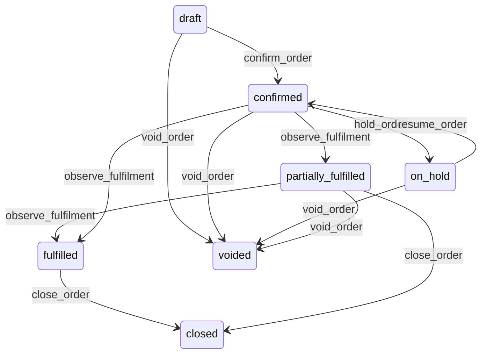

# State machine — Order

*Generated. Edit `_model/capabilities/order.yaml`, not this file.*

## Transition matrix

| From \\ To | `draft` | `confirmed` | `partially_fulfilled` | `fulfilled` | `closed` | `voided` | `on_hold` |
|---|---|---|---|---|---|---|---|
| **`draft`** | · | `confirm_order` | — | — | — | `void_order` | — |
| **`confirmed`** | — | · | `observe_fulfilment` | `observe_fulfilment` | — | `void_order` | `hold_order` |
| **`partially_fulfilled`** | — | — | · | `observe_fulfilment` | `close_order` | `void_order` | — |
| **`fulfilled`** | — | — | — | · | `close_order` | — | — |
| **`closed`** | — | — | — | — | · | — | — |
| **`voided`** | — | — | — | — | — | · | — |
| **`on_hold`** | — | `resume_order` | — | — | — | `void_order` | · |

Any transition marked `—` attempted at runtime returns `E_PRECONDITION`. It is never a silent no-op, because a silent no-op is how an operator believes work was recorded when it was not.

## Stuck-state policy

### `draft`

A draft order is somebody mid-conversation. Threshold: draft_order_stale_minutes (default 30) for an in-person or telephone channel, and draft_order_stale_hours (default 24) for a self-service one, because the two are different behaviours - one is an interrupted conversation and the other is an abandoned basket. Told: the taking principal for the first, nobody for the second. Escape hatch: confirm or void. Never auto-confirmed. An auto-confirmed draft is an order somebody did not place, and it will be produced, dispatched and charged for.

### `confirmed`

Two monitored exceptions. (a) A confirmed order with no line acknowledged by any fulfilment route within routing_ack_minutes (default 5) - the order was accepted and nothing is happening. Told: the taking principal and the location supervisor, and this is the most damaging quiet failure here because the party has been told it is coming. (b) A confirmed order past its promised_for_at with lines still unfulfilled. Told: the supervisor, then the party where a surface is bound, because a party told nothing is a party who telephones.

### `partially_fulfilled`

The state that reads as progress on a summary screen and is frequently stalled. Threshold: partial_stall_minutes (default 20) with no further line movement. Told: the supervisor with the SHORTFALL named as a count of outstanding lines, never as a percentage. Escape hatch: fulfil, void the remainder with a reason, or close short.

### `fulfilled`

Fulfilled and unclosed is an unsettled commercial position. Threshold: unclosed_order_days (default 3) where payment is outstanding, and unclosed_paid_order_days (default 7) where it is not. Told: the location supervisor, then finance. Escape hatch: close, or write off with a reason. The specific monitored case is a fulfilled order that is unpaid and forgotten, which is simply revenue walking away.

### `closed`

Terminal and immutable. The one thing still pending is downstream - a closed order whose billable outcome was never acknowledged within outcome_ack_hours (default 4) is reported to platform_operator, because an order that never reached billing is revenue that disappears silently.

### `voided`

Terminal. Retained permanently with the reason and the voiding principal, and never deleted, because a voided order is precisely what somebody will later allege was removed to conceal something. The monitored condition is a pattern - voids by one principal exceeding void_rate_alert of their orders (default 0.05), reported to ops_manager. Individually every void may be legitimate; collectively a high rate is the classic signature of both a broken capture flow and of theft, and the two are distinguished by looking, not by guessing.

### `on_hold`

Threshold: order_hold_review_minutes (default 30), escalating to the supervisor. Told: the holding principal. Escape hatch: resume or void. A held order is invisible to fulfilment and visible to the party as accepted, which is the worst combination and the reason the threshold is in minutes rather than hours.

