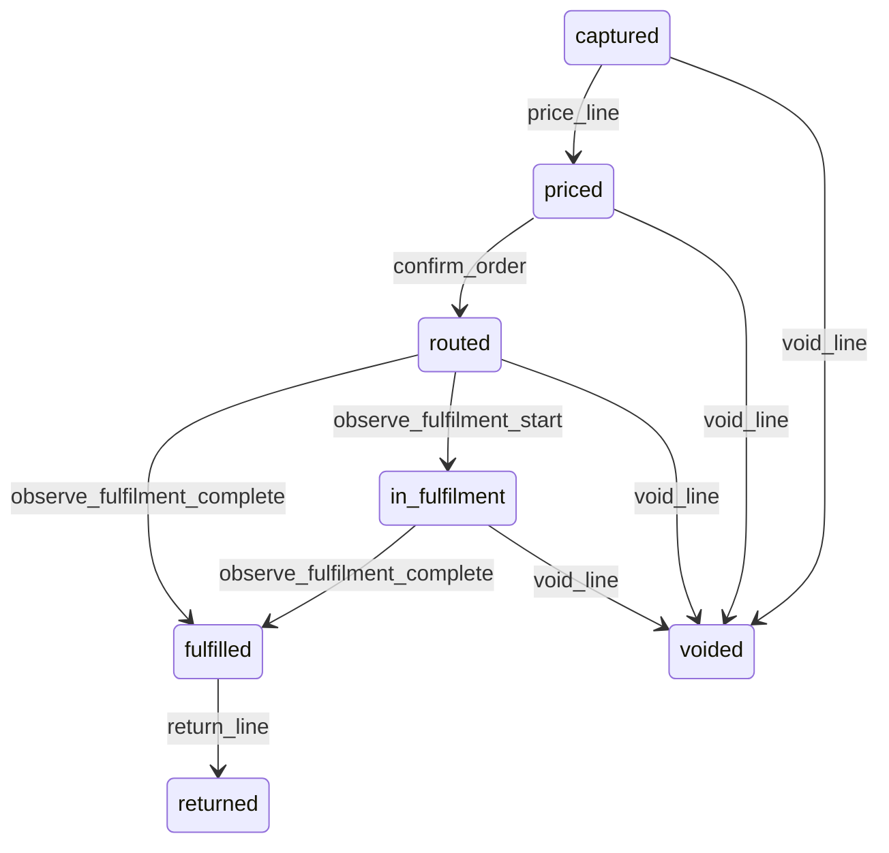

# State machine — Order Line

*Generated. Edit `_model/capabilities/order.yaml`, not this file.*

## Transition matrix

| From \\ To | `captured` | `priced` | `routed` | `in_fulfilment` | `fulfilled` | `voided` | `returned` |
|---|---|---|---|---|---|---|---|
| **`captured`** | · | `price_line` | — | — | — | `void_line` | — |
| **`priced`** | — | · | `confirm_order` | — | — | `void_line` | — |
| **`routed`** | — | — | · | `observe_fulfilment_start` | `observe_fulfilment_complete` | `void_line` | — |
| **`in_fulfilment`** | — | — | — | · | `observe_fulfilment_complete` | `void_line` | — |
| **`fulfilled`** | — | — | — | — | · | — | `return_line` |
| **`voided`** | — | — | — | — | — | · | — |
| **`returned`** | — | — | — | — | — | — | · |

Any transition marked `—` attempted at runtime returns `E_PRECONDITION`. It is never a silent no-op, because a silent no-op is how an operator believes work was recorded when it was not.

## Stuck-state policy

### `captured`

An unpriced captured line blocks confirmation of the whole order. Threshold: immediate - the surface shows it as unpriced at the moment it is captured rather than at confirmation. Told: the capturing principal, in place, not by notification. Escape hatch: resolve a price, override with a reason, or void. The failure this prevents is somebody typing an order, walking away, and the order failing to confirm at the moment the party is waiting to pay.

### `priced`

Bounded by order confirmation. Not separately monitored - the order's own draft policy governs.

### `routed`

Routed and not started is the fulfilment queue's problem and is visible here as the order's routing acknowledgement monitor. Threshold: route_start_alert_minutes (default 15) past promised_for_at where one is set. Told: the supervisor. Escape hatch: chase the route, reroute, or void the line.

### `in_fulfilment`

Threshold: line_fulfilment_alert_minutes (default 30) or twice the item's expected duration where the orderable_item port supplies one, whichever is greater. Told: the fulfilment route first, then the supervisor. Escape hatch: complete, or void with elevation. A line in fulfilment indefinitely is consuming a station and delaying every line behind it, which is why the threshold is derived from the item rather than fixed.

### `fulfilled`

Terminal in fulfilment terms. Bounded by the order's own closure. Nothing separately pends.

### `voided`

Terminal. Retained with the reason. Where the void happened after fulfilment started and the route refused cancellation, the line is retained as produced-and-voided and its cost is reported, because that cost is real and absorbing it silently means the tenant never learns what late voids cost them.

### `returned`

Terminal. Retained. The monitored condition is a pattern - returns concentrated on one item or one principal above return_rate_alert (default 0.05), told to ops_manager, because a concentrated return rate is either a quality problem or a capture problem and both are actionable once visible.

