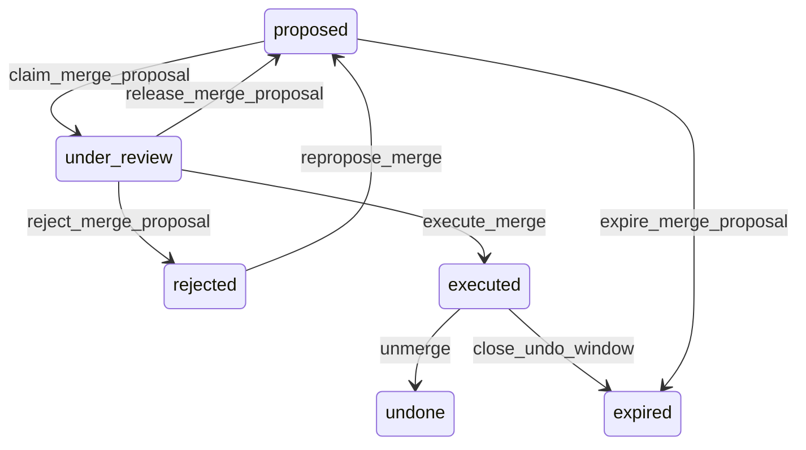

# State machine — Merge Proposal

*Generated. Edit `_model/capabilities/party.yaml`, not this file.*

## Transition matrix

| From \\ To | `proposed` | `under_review` | `rejected` | `executed` | `undone` | `expired` |
|---|---|---|---|---|---|---|
| **`proposed`** | · | `claim_merge_proposal` | — | — | — | `expire_merge_proposal` |
| **`under_review`** | `release_merge_proposal` | · | `reject_merge_proposal` | `execute_merge` | — | — |
| **`rejected`** | `repropose_merge` | — | · | — | — | — |
| **`executed`** | — | — | — | · | `unmerge` | `close_undo_window` |
| **`undone`** | — | — | — | — | · | — |
| **`expired`** | — | — | — | — | — | · |

Any transition marked `—` attempted at runtime returns `E_PRECONDITION`. It is never a silent no-op, because a silent no-op is how an operator believes work was recorded when it was not.

## Stuck-state policy

### `proposed`

This is the queue that decides whether the deduplication feature is real or decorative. Threshold: proposal_ttl_days (default 60), with the queue depth reported weekly to tenant_admin regardless. Told: tenant_admin. Escape hatch: review, or raise duplicate_alert_threshold so fewer proposals are generated. Raising the threshold is offered explicitly in the notification, because the common failure is a threshold set too low producing a queue so large that genuine duplicates are never found in it.

### `under_review`

A claimed proposal blocks anyone else from resolving it. Threshold: merge_claim_timeout_minutes (default 60), after which the claim is released automatically and the proposal returns to the queue. Told: nobody - this is routine and notifying on it would train people to ignore the notification. The reviewer who lost the claim is told only if they had entered a partial field_resolution, which is preserved as a draft.

### `rejected`

Terminal until something changes. Not monitored on a timer. The monitored exception is the same pair being proposed and rejected more than repeat_rejection_threshold times (default 3), which means a matching rule is wrong rather than the pair being interesting. Told: tenant_admin, with the rule that keeps firing named, so the fix is to the rule rather than to the queue.

### `executed`

Bounded by undo_deadline_at. See the party.merged stuck policy, which is where the operationally significant thresholds live. Nothing further pends here.

### `undone`

Terminal. The unmerge is complete and both parties are separate again. Retained permanently as evidence that a merge was attempted and reversed, because that pair will be proposed again and the reviewer needs to know it was tried.

### `expired`

Terminal. Either a proposal nobody reviewed or a merge whose undo window closed. The two are distinguished by whether executed_at is set. Nothing pends.

