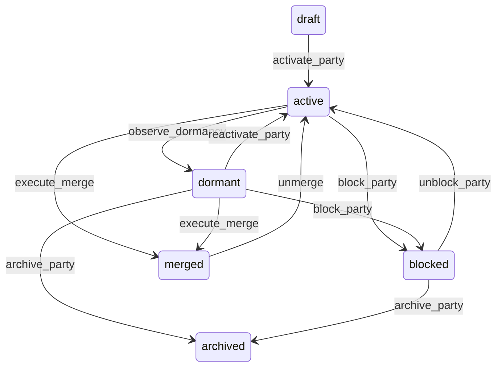

# State machine — Party

*Generated. Edit `_model/capabilities/party.yaml`, not this file.*

## Transition matrix

| From \\ To | `draft` | `active` | `dormant` | `blocked` | `merged` | `archived` |
|---|---|---|---|---|---|---|
| **`draft`** | · | `activate_party` | — | — | — | — |
| **`active`** | — | · | `observe_dormancy` | `block_party` | `execute_merge` | — |
| **`dormant`** | — | `reactivate_party` | · | `block_party` | `execute_merge` | `archive_party` |
| **`blocked`** | — | `unblock_party` | — | · | — | `archive_party` |
| **`merged`** | — | `unmerge` | — | — | · | — |
| **`archived`** | — | — | — | — | — | · |

Any transition marked `—` attempted at runtime returns `E_PRECONDITION`. It is never a silent no-op, because a silent no-op is how an operator believes work was recorded when it was not.

## Stuck-state policy

### `draft`

A draft party is a half-typed record, usually created when somebody opened a form to check whether a counterparty already existed and then navigated away. Threshold: draft_party_stale_days (default 7). Told: the creating principal only, never the administrator, because a stream of "you left a form open" notifications to an administrator is noise. Escape hatch: complete it or discard it. Discard is a hard delete rather than an archive in this one state, because a never-activated draft has no history worth keeping and keeping it pollutes every duplicate check afterwards.

### `active`

Steady state. Two monitored exceptions. (a) A party active with no relationship of any kind for lead_stale_days (default 90) - a lead that never became anything. Told: the owning principal where a relationship owner exists, otherwise nobody, and it appears in a periodic list rather than as a notification. (b) A party whose duplicate score against another active party exceeds duplicate_alert_threshold and which has not been reviewed. Told: tenant_admin, as a queue. This is the single most valuable list in this capability and it is deliberately a queue somebody works, not an alert somebody dismisses.

### `dormant`

Dormancy is a valid long-term state and is not a queue. The monitored exception is a dormant party with an open financial obligation, which should be impossible and is a data-integrity alert rather than an operational one, because dormancy is computed from relationship activity and an open balance is relationship activity. Told: finance and platform_operator. Escape hatch: none needed - the condition indicates a defect in the dormancy computation, not a decision anyone has to make.

### `blocked`

Blocking is a decision that should be revisited, not a permanent state reached by accident. Threshold: block_review_days (default 90). Told: the blocking principal and finance. Escape hatch: unblock_party or archive_party. Verity never auto-unblocks - a party blocked for non-payment does not become creditworthy because ninety days passed.

### `merged`

Terminal in effect but reversible within merge_undo_days (default 30). The monitored exception is a merge whose undo window is about to close and which has an open dispute or a raised objection against it. Told: the executing principal and tenant_admin, at 7 days and 1 day before the window closes. Escape hatch: unmerge, or let the window close deliberately. After the window the merge journal is discarded and the merge is permanent, which is stated at execution time rather than discovered later.

