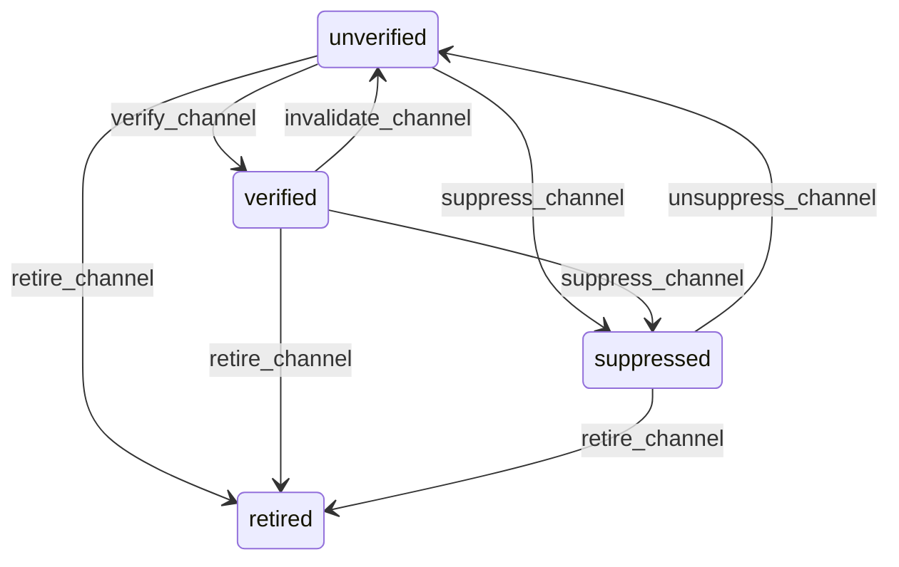

# State machine — Party Channel

*Generated. Edit `_model/capabilities/party.yaml`, not this file.*

## Transition matrix

| From \\ To | `unverified` | `verified` | `suppressed` | `retired` |
|---|---|---|---|---|
| **`unverified`** | · | `verify_channel` | `suppress_channel` | `retire_channel` |
| **`verified`** | `invalidate_channel` | · | `suppress_channel` | `retire_channel` |
| **`suppressed`** | `unsuppress_channel` | — | · | `retire_channel` |
| **`retired`** | — | — | — | · |

Any transition marked `—` attempted at runtime returns `E_PRECONDITION`. It is never a silent no-op, because a silent no-op is how an operator believes work was recorded when it was not.

## Stuck-state policy

### `unverified`

An unverified channel is the normal state for anything typed by a member of staff from a business card, and most will never be verified. It is therefore not a queue. The monitored exception is an unverified channel that is the ONLY channel on a party who has an active obligation - meaning the business has committed to somebody it cannot reliably reach. Threshold: immediate on the obligation being created, not on a timer. Told: the principal who created the obligation. Escape hatch: verify, or add a second channel, or accept it explicitly with a recorded acknowledgement.

### `verified`

Steady state. The monitored exception is decay - a verified channel with no successful delivery for channel_decay_days (default 365) and at least one failure in that period. It is reported, not auto-invalidated, because auto-invalidating the only channel on a quiet party makes them unreachable at exactly the moment somebody finally needs to reach them.

### `suppressed`

Suppression is meant to be permanent unless something changes. Threshold: suppression_review_days (default 180), and only for suppressions caused by bounces rather than by an opt-out. Told: the party's relationship owner. Escape hatch: unsuppress with a reason, or retire. An opt-out suppression is never reviewed and never surfaced for reconsideration, because presenting it as a decision to revisit is how a business talks itself into contacting somebody who asked it not to.

### `retired`

Terminal. The channel is out of every picker and out of every send, and is retained so that a historical send still resolves to the channel it went to. Nothing pends. Re-adding the same value creates a NEW channel row in unverified, so the gap in its verification history is visible rather than papered over.

