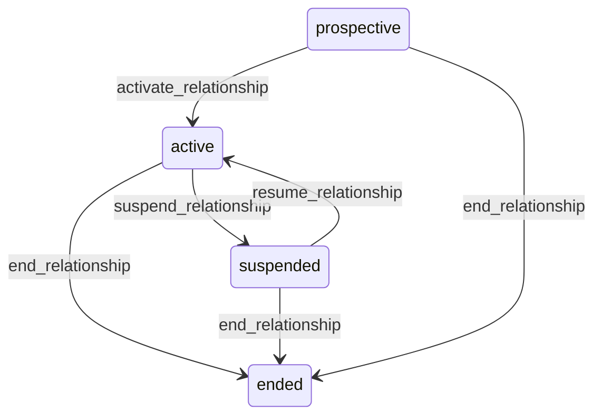

# State machine — Party Relationship

*Generated. Edit `_model/capabilities/party.yaml`, not this file.*

## Transition matrix

| From \\ To | `prospective` | `active` | `suspended` | `ended` |
|---|---|---|---|---|
| **`prospective`** | · | `activate_relationship` | — | `end_relationship` |
| **`active`** | — | · | `suspend_relationship` | `end_relationship` |
| **`suspended`** | — | `resume_relationship` | · | `end_relationship` |
| **`ended`** | — | — | — | · |

Any transition marked `—` attempted at runtime returns `E_PRECONDITION`. It is never a silent no-op, because a silent no-op is how an operator believes work was recorded when it was not.

## Stuck-state policy

### `prospective`

A prospective relationship that never activates is the ordinary outcome of most commercial conversations and is not a fault. Threshold: prospect_stale_days (default 120). Told: the relationship owner, as a list. Escape hatch: activate or end. Verity never auto-ends a prospect, because a twelve-month sales cycle is normal in the target segment and auto-ending would delete the pipeline of exactly the businesses with the longest deals.

### `active`

Steady state. Monitored exception: an active relationship with no owner for unowned_relationship_days (default 30). An unowned relationship is one nobody will notice going wrong. Told: ops_manager. Escape hatch: assign an owner. This condition arises constantly when the previous owner leaves, which is why revoking a membership lists the relationships that will become unowned.

### `suspended`

Threshold: relationship_suspension_review_days (default 60). Told: the suspending principal and the relationship owner, escalating to ops_manager. Escape hatch: resume or end. A suspension nobody resolves eventually gets worked around by creating a second party record, which is the duplicate this capability exists to prevent.

### `ended`

Terminal. Retained forever - the history of who the tenant traded with is the capability's most valuable long-term asset and the thing a duplicate check needs most. Nothing pends. Re-engagement creates a NEW relationship row so the gap is visible rather than papered over.

