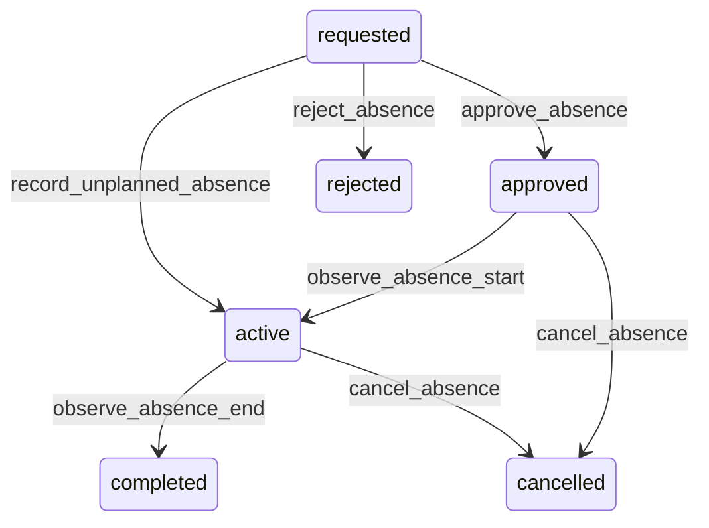

# State machine — Absence

*Generated. Edit `_model/capabilities/people.yaml`, not this file.*

## Transition matrix

| From \\ To | `requested` | `approved` | `active` | `completed` | `cancelled` | `rejected` |
|---|---|---|---|---|---|---|
| **`requested`** | · | `approve_absence` | `record_unplanned_absence` | — | — | `reject_absence` |
| **`approved`** | — | · | `observe_absence_start` | — | `cancel_absence` | — |
| **`active`** | — | — | · | `observe_absence_end` | `cancel_absence` | — |
| **`completed`** | — | — | — | · | — | — |
| **`cancelled`** | — | — | — | — | · | — |
| **`rejected`** | — | — | — | — | — | · |

Any transition marked `—` attempted at runtime returns `E_PRECONDITION`. It is never a silent no-op, because a silent no-op is how an operator believes work was recorded when it was not.

## Stuck-state policy

### `requested`

An unanswered leave request is the most common quiet grievance in a workforce. Threshold: absence_approval_hours (default 48), or immediately if starts_at is within that window. Told: the approving supervisor, escalating to ops_manager, and the member is shown that it is still awaiting an answer rather than being left to guess. Escape hatch: approve or reject. Verity never auto-approves and never auto-rejects. A request that reaches its start date unanswered stays requested and is escalated loudly, because the member will act on their own assumption either way and the dispatcher needs to know which.

### `approved`

Bounded by starts_at. The monitored exception is an approved absence whose window overlaps an assignment that was never reassigned, reported continuously to the dispatcher rather than on a timer, because the cost lands on the day.

### `active`

Bounded by ends_at. The monitored exception is overrun - see the on_leave stuck policy on workforce_member, which is where the operationally significant thresholds live and is deliberately not duplicated here.

### `completed`

Terminal. Retained. Nothing pends.

### `cancelled`

Terminal. Retained with the reason, because a cancelled absence and an absence that never existed are different facts when somebody asks why cover was arranged.

### `rejected`

Terminal. Retained with the reason. Nothing pends. A rejection is not a queue, but the rate of rejection by approver is a reportable metric, because an approver who rejects everything and an approver who approves everything are both problems.

