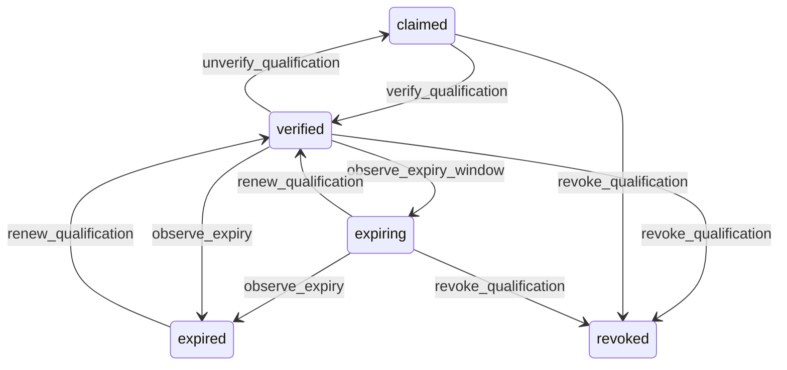

# State machine — Qualification

*Generated. Edit `_model/capabilities/people.yaml`, not this file.*

## Transition matrix

| From \\ To | `claimed` | `verified` | `expiring` | `expired` | `revoked` |
|---|---|---|---|---|---|
| **`claimed`** | · | `verify_qualification` | — | — | `revoke_qualification` |
| **`verified`** | `unverify_qualification` | · | `observe_expiry_window` | `observe_expiry` | `revoke_qualification` |
| **`expiring`** | — | `renew_qualification` | · | `observe_expiry` | `revoke_qualification` |
| **`expired`** | — | `renew_qualification` | — | · | — |
| **`revoked`** | — | — | — | — | · |

Any transition marked `—` attempted at runtime returns `E_PRECONDITION`. It is never a silent no-op, because a silent no-op is how an operator believes work was recorded when it was not.

## Stuck-state policy

### `claimed`

An unverified claim is the normal state of a qualification typed in from a photograph on a phone, and it counts for nothing. The risk is that everyone assumes it counts. Threshold: claimed_qualification_stale_days (default 14). Told: the supervisor of the member's primary location. Escape hatch: verify or delete. The member's own record shows the qualification as not yet verified in the same place the dispatcher sees it, so the two never hold different beliefs about it.

### `verified`

Steady state, bounded by valid_to where one exists. The monitored exception is a qualification of a type whose issuer can be checked directly but whose verification_method is only document_seen, for longer than weak_verification_review_days (default 180). Told: ops_manager, as a list, quarterly. Advisory, because upgrading a verification usually requires the issuer's cooperation and the tenant may have no way to get it.

### `expiring`

Bounded by valid_to. The point of the state is that somebody acts before it lapses. Notifications at 60, 30 and 7 days, and daily in the final week, to the member, the supervisor and - only where assignments exist beyond the expiry - the dispatcher. Escape hatch: renew, or accept the lapse and let the assignments be reassigned. Verity never auto-renews and never extends a validity period on the strength of a renewal being in progress, because a qualification that is being renewed is not a qualification that is valid.

### `expired`

Threshold: immediate. An expired mandatory qualification makes the member unassignable, which is a live operational problem rather than a queue. Told: the dispatcher and the supervisor at the moment of expiry, with the specific assignments at risk. Escalation continues daily until renewed, revoked, or the member is moved out of active. Escape hatch: renew, or reassign the work. The one thing that must not happen is the assignment silently proceeding, which is why the expiry withdraws eligibility immediately rather than at the next assignment attempt.

### `revoked`

Terminal. Retained permanently as the record that the qualification was held and was withdrawn, with the reason, because that is precisely the question asked after an incident. Nothing pends.

