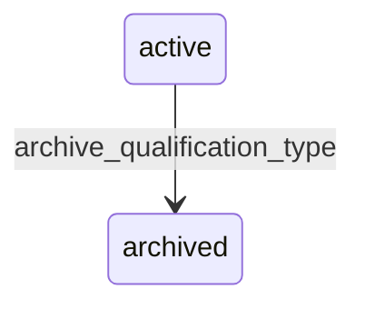

# State machine — Qualification Type

*Generated. Edit `_model/capabilities/people.yaml`, not this file.*

## Transition matrix

| From \\ To | `active` | `archived` |
|---|---|---|
| **`active`** | · | `archive_qualification_type` |
| **`archived`** | — | · |

Any transition marked `—` attempted at runtime returns `E_PRECONDITION`. It is never a silent no-op, because a silent no-op is how an operator believes work was recorded when it was not.

## Stuck-state policy

### `active`

Not a queue. The monitored exception is a type marked mandatory_for_engagement that no active member holds, which means either it was created and never applied or every member is out of compliance - two very different situations that look identical in a list. Told: ops_manager, with which of the two it is. Escape hatch: apply it, relax it, or archive it.

