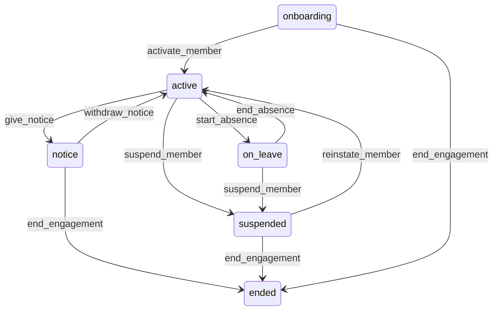

# State machine — Workforce Member

*Generated. Edit `_model/capabilities/people.yaml`, not this file.*

## Transition matrix

| From \\ To | `onboarding` | `active` | `on_leave` | `suspended` | `notice` | `ended` |
|---|---|---|---|---|---|---|
| **`onboarding`** | · | `activate_member` | — | — | — | `end_engagement` |
| **`active`** | — | · | `start_absence` | `suspend_member` | `give_notice` | — |
| **`on_leave`** | — | `end_absence` | · | `suspend_member` | — | — |
| **`suspended`** | — | `reinstate_member` | — | · | — | `end_engagement` |
| **`notice`** | — | `withdraw_notice` | — | — | · | `end_engagement` |
| **`ended`** | — | — | — | — | — | · |

Any transition marked `—` attempted at runtime returns `E_PRECONDITION`. It is never a silent no-op, because a silent no-op is how an operator believes work was recorded when it was not.

## Stuck-state policy

### `onboarding`

The most consequential queue in this capability. A member stuck in onboarding is a person who believes they have a job and whom the dispatcher cannot assign, and the two facts usually meet at 5am on the first day. Threshold: onboarding_stale_days (default 7), and immediately once engaged_from has passed while still onboarding. Told: the recruiting principal and the supervisor of the primary location, and the notification names the SPECIFIC missing qualification or document rather than saying onboarding is incomplete. Escape hatch: supply what is missing, or activate with a recorded override where the tenant's rule permits overriding, or end the engagement. Verity never auto-activates, because activating without a mandatory qualification is exactly the failure the qualification exists to prevent.

### `active`

Steady state. Three monitored exceptions. (a) A member with a qualification expiring within qualification_warning_days who has assignments beyond the expiry - a person scheduled to do work they will not be permitted to do. Told: the member, the supervisor and the dispatcher, at 60, 30 and 7 days. (b) A member who has exceeded a working-hour limit in the trailing period - reported even though the limit is enforced at assignment time, because retrospective breaches arrive through absence cover and manual overrides. Told: the supervisor and ops_manager, daily. (c) A member with no assignment for unassigned_member_days (default 30) while their engagement kind implies regular work. Told: ops_manager, as a list. This is usually somebody who left without anyone recording it, and every per-head metric is wrong until it is resolved.

### `on_leave`

Bounded by the absence record, which always has an end date. The monitored exception is leave that overruns its recorded end by absence_overrun_days (default 3) with no extension recorded. Told: the supervisor. Escape hatch: extend the absence, or return the member to active, or move to suspended pending an explanation. Verity does not auto-return a member to active on the recorded end date, because a member who is automatically made schedulable and then does not appear produces an unstaffed commitment, which is the outcome this capability exists to avoid.

### `suspended`

Threshold: member_suspension_review_days (default 21) - deliberately shorter than the equivalent review elsewhere, because a suspended person is usually unpaid and the cost of a forgotten suspension falls on them. Told: the suspending principal and ops_manager, escalating to tenant_owner at twice the threshold. Escape hatch: reinstate or end. No automatic resolution in either direction.

### `notice`

Bounded by engaged_to. The monitored exception is assignments existing beyond the end date, reported continuously rather than on a timer, with the count and the dates, to the dispatcher. Escape hatch: reassign them. At 7 days before the end date, and again at 1 day, the dispatcher is told regardless of whether anything has changed, because the failure mode is silence rather than disagreement.

### `ended`

Terminal. The record is retained permanently and remains the attribution target for every hour worked, every piece of work completed and every document signed. Nothing pends. Re-engagement creates a NEW member row rather than reviving this one, so the gap is visible - which also means the rehire identity question filed against core_identity_session bites here too.

