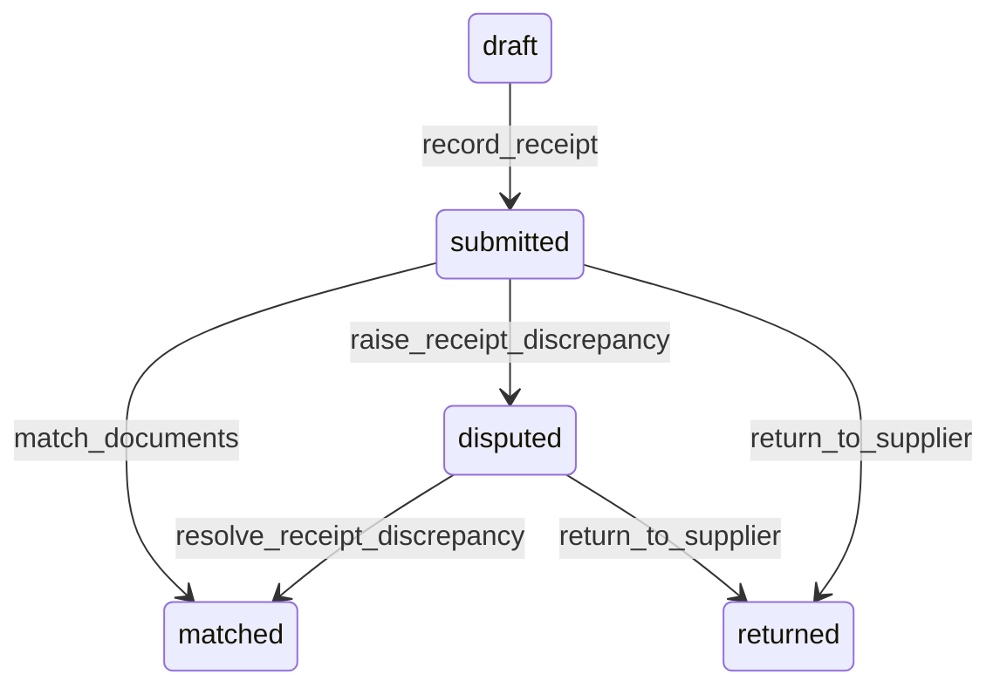

# State machine — Receipt

*Generated. Edit `_model/capabilities/procurement.yaml`, not this file.*

## Transition matrix

| From \\ To | `draft` | `submitted` | `matched` | `disputed` | `returned` |
|---|---|---|---|---|---|
| **`draft`** | · | `record_receipt` | — | — | — |
| **`submitted`** | — | · | `match_documents` | `raise_receipt_discrepancy` | `return_to_supplier` |
| **`matched`** | — | — | · | — | — |
| **`disputed`** | — | — | `resolve_receipt_discrepancy` | · | `return_to_supplier` |
| **`returned`** | — | — | — | — | · |

Any transition marked `—` attempted at runtime returns `E_PRECONDITION`. It is never a silent no-op, because a silent no-op is how an operator believes work was recorded when it was not.

## Stuck-state policy

### `draft`

A receipt in draft is goods physically present and not recorded. Threshold: draft_receipt_stale_minutes (default 60) - in minutes, because the goods are on the floor. Told: the receiving principal, then the location supervisor. Escape hatch: submit or discard. Verity never auto-submits, because a receipt submitted with lines somebody had not finished checking becomes stock the operation does not have.

### `submitted`

Submitted and unmatched is where duplicate supplier invoices survive. Threshold: match_lag_days (default 5). Told: finance. Escape hatch: match, dispute or accept unmatched with a reason. A receipt with no commitment at all is reported separately and immediately, because it is either an unrecorded purchase or a delivery to the wrong place, and both need somebody today.

### `matched`

Terminal in receipt terms. Nothing pends here; the commitment's own closure policy governs.

### `disputed`

A dispute with a supplier holds up payment and frequently holds up the operation. Threshold: receipt_dispute_days (default 7), escalating to ops_manager then finance. Told: finance, the receiving location and the supplier where a channel is bound. Escape hatch: resolve. Never auto-resolved in the supplier's favour by expiry, and never auto-resolved in the tenant's favour either - both amount to deciding a commercial disagreement with a timer.

### `returned`

Terminal on the receipt. The monitored exception is a return with no supplier credit received within credit_expectation_days (default 30). Told: finance, with the value. Returns for which no credit ever arrives are one of the most reliable sources of quiet loss in a purchasing operation, and they are invisible unless the expectation is recorded at the moment of return.

