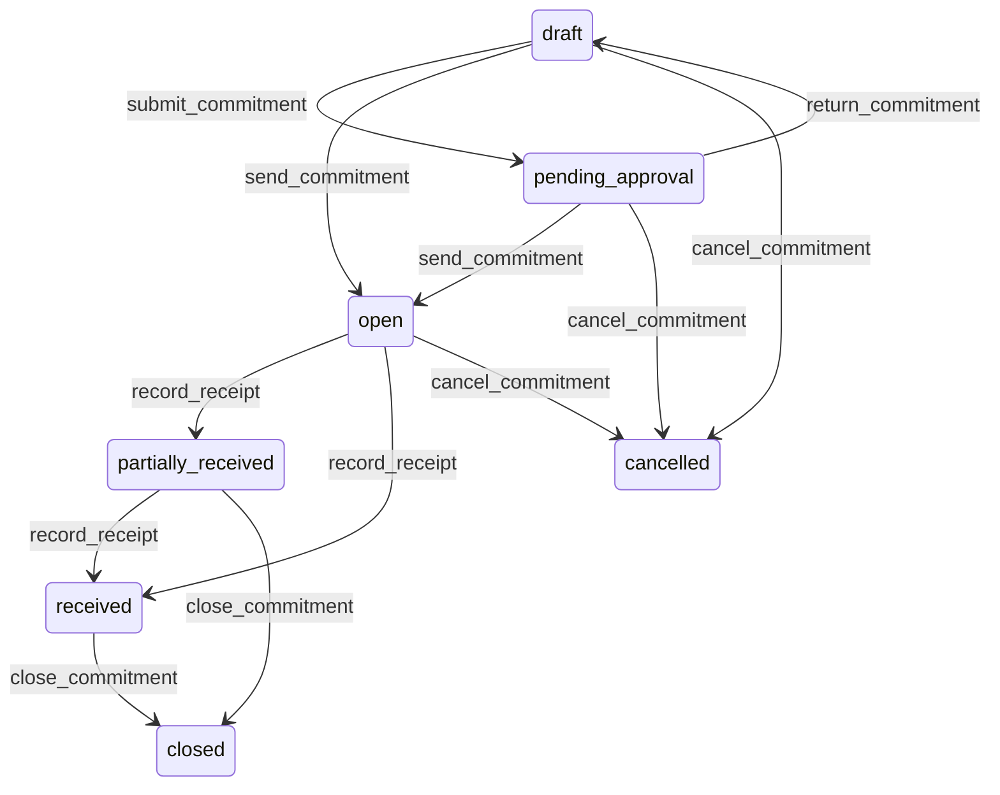

# State machine — Purchase Commitment

*Generated. Edit `_model/capabilities/procurement.yaml`, not this file.*

## Transition matrix

| From \\ To | `draft` | `pending_approval` | `open` | `partially_received` | `received` | `closed` | `cancelled` |
|---|---|---|---|---|---|---|---|
| **`draft`** | · | `submit_commitment` | `send_commitment` | — | — | — | `cancel_commitment` |
| **`pending_approval`** | `return_commitment` | · | `send_commitment` | — | — | — | `cancel_commitment` |
| **`open`** | — | — | · | `record_receipt` | `record_receipt` | — | `cancel_commitment` |
| **`partially_received`** | — | — | — | · | `record_receipt` | `close_commitment` | — |
| **`received`** | — | — | — | — | · | `close_commitment` | — |
| **`closed`** | — | — | — | — | — | · | — |
| **`cancelled`** | — | — | — | — | — | — | · |

Any transition marked `—` attempted at runtime returns `E_PRECONDITION`. It is never a silent no-op, because a silent no-op is how an operator believes work was recorded when it was not.

## Stuck-state policy

### `draft`

Threshold: draft_commitment_stale_days (default 3) - short, because a draft commitment usually exists because an approved request is waiting behind it. Told: the creating principal and finance. Escape hatch: send or cancel. The approved-request monitor fires in parallel, deliberately, so that the gap is visible from both ends.

### `pending_approval`

Threshold: commitment_approval_days (default 2), or immediately where expected_at is inside the supplier lead time. Told: the approver, then finance, then tenant_owner where the value exceeds the escalation threshold. Escape hatch: approve, return or cancel. Never auto-approved at any value.

### `open`

Two monitored exceptions. (a) A commitment past expected_at with nothing received. Threshold: immediate on the date passing, then every overdue_chase_days (default 3). Told: the raising principal and the requester behind it, with the supplier's contact, because the required action is a telephone call. (b) A commitment sent and never acknowledged for acknowledgement_days (default 2) where the channel supports acknowledgement - the supplier may never have received it, which looks identical to a late delivery until somebody asks.

### `partially_received`

The state that reads as progress and is frequently finished in reality - the supplier short-shipped and nobody closed it. Threshold: partial_receipt_stale_days (default 7) with no further receipt. Told: the receiving location and finance, with the outstanding quantity NAMED rather than expressed as a percentage. Escape hatch: receive the rest, close short with a reason, or chase. A commitment left partially received holds a reservation and inflates expected stock indefinitely.

### `received`

Received and unclosed is an unmatched liability. Threshold: match_lag_days (default 5) where an invoice has arrived, and unclosed_received_days (default 30) where it has not. Told: finance. Escape hatch: close, or record the variance. A received and unmatched commitment is where duplicate supplier invoices survive, because nothing has yet claimed the receipt.

### `closed`

Terminal and immutable. The monitored exception is a supplier invoice arriving against a closed commitment, which is either a duplicate or a late claim and must never be matched automatically. Told: finance immediately, with the closed commitment named.

### `cancelled`

Terminal. Retained with the reason and the notification that was sent to the supplier, because a supplier who delivers against a cancelled commitment will produce the copy they were sent. Nothing pends.

